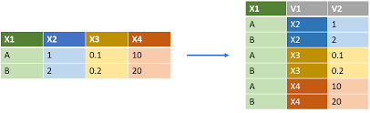
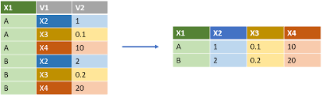

# Manipulation de données avec **R**

Les packages à installer pour ce chapitre 

```{r, eval = F}
install.packages(c(
  # import data:
  "foreign", "jsonlite", "readr", "readxl", "sas7bdat", "XML", 
  # big data analysis
  "data.table", "ff", "ffbase", 
  # matrices creuses
  "Marix", 
  # character treatment
  "classInt", "glue", "stringr", "wordcloud", 
  "gplots", # plotting data with ggplot2 style
  "tidyverse", "DSR", # Data Scientists toolkits
  "Amelia", "DMwR", "missForest", "naniar",  # missing values treatement
  "sp", "sf", # spatial data object
  "zoo")  # Time series analysis
)
```


## Les chaînes de caractères  

### Fonctions de base 

On considère la chaîne de caractère suivante : 

```{r}
phrase <- "Notes obtenues\nanglais: 16, Stat:14, Eco=18"
class(phrase)
```

Parmi les fonctions qui permettent de manipuler les chaînes de caractères, voici celles qui nous semblent importantes de connaître : 


- La fonction `nchar()` permet de compter le nombre de caractères de chaque élément d'un vecteur :

```{r}
nchar(phrase)
```

- La fonction `substr()` permet d'extraire un sous-ensemble de caractères :

```{r}
substr(phrase, start = 1, stop = 5)
```

- La fonction `strsplit()` permet d'éclater une chaîne de caractères dès qu'on trouve une sous-chaîne particulière : 

```{r}
strsplit(phrase, split = " ")
strsplit(phrase, split = "\n")
```

**Remarque 1 :** un espace est considéré comme une chaîne de caractère. 

**Remarque 2 :** "\\n" est un caractère spécial qui correspond à un saut de ligne (pour consulter la liste des caractères spéciaux, voir cette [page web](http://help.stonesoft.com/onlinehelp/StoneGate/SMC/5.3.6/SGAG/SG_RegularExpressions/Special_Character_Sequences.htm)). Pour évaluer un caractère spécial dans une chaîne de caractère, on peut utiliser la fonction *cat()*:

```{r}
cat(phrase)
```


**Remarque 3 :** l'objet retourné est de type **list**. Pour convertir une **list** en un vecteur, sur lequel il est plus facile de faire de la manipulation, on utilise la fonction *unlist()*. Enfin, si on veut éclater une chaîne de caractère en fonction de plusieurs caractères, on utilise le symbole |. Dans l'exemple suivant, l'idée est de séparer tous les mots en présence d'un des caractères spéciaux : 

```{r}
(mots <- strsplit(phrase, split = ",|\n| |:|="))
(mots <- unlist(mots))
```


Si on utilise le type **NULL** comme critère de recherche, cela a pour effet d'éclater tous les éléments de la chaîne de caractères en des caractères uniques : 

```{r}
(lettres <- strsplit(phrase, split = NULL))
length(lettres[[1]])
```

**Remarque :** dans le contexte d'une étude statistique, on appliquera cette fonction à des vecteurs de caractère. Par exemple :

```{r}
strsplit(mots, split = ":")
```


- Les fonctions `toupper()` et `tolower()`` pemettent de convertir toutes les lettres en majuscules et minuscules : 

```{r}
toupper(phrase)
tolower("AAA")
```


- La fonction `grep()` permet de trouver dans un vecteur de caractères quels sont les indices des composantes du vecteur qui contiennent un ensemble de caractères. Par exemple quels sont les mots qui contiennent la lettre "e" :  

```{r}
(res <- grep(pattern = "e", x = mots))
mots[res]
```

On peut chercher plusieurs lettres à la fois. Ici, on cherche les mots qui contiennent une des lettres "j", "J" et "t". Pour cela, on utilise une expression régulière grâce aux crochets (nous verrons dans la section suivante plus en détail le fonctionnement des expressions régulières) : 

```{r}
(res <- grep(pattern = "[jSE]", x = mots))
mots[res]
```


**Remarque :** un vecteur de taille nulle est retourné si le critère n'est pas satisfait. 

- La fonction `agrep()` premet de trouver dans un vecteur de caractères quels sont les indices des composantes du vecteur qui contiennent "approximativement" une sous-chaîne, l'approximation pouvant être réglée avec les options de la fonction. Dans l'exemple suivant, la lettre s minuscule est différente de S majuscule, mais cette différence d'1 caractère sera tolérée. 

```{r}
agrep("stat", mots)
```

**Remarque :** lorsqu'on traite des fichiers de données brutes, ce fichier peut contenir des erreurs de saisie, par exemple "Toulouze" au lieu de "Toulouse" et c'est pourquoi le fait de tolérer un nombre de différences peut s'avérer intéressant. 

- La fonction `sub()` permet de changer une sous-chaîne de caractères par une autre :

```{r}
(mots <- sub(pattern = "=", replacement = ":", x = phrase))
```

- La fonction `regexpr()` permet de dire à quelle position dans le mot se trouve une sous-chaîne de caractères. Dans l'exemple suivant, on cherche à savoir où se trouve le caractère ":" dans les mots. Si un caractère est présent, alors la fonction retourne les positions de la lettre ":" et si elle n'apparaît pas, la valeur -1 est retournée. Le résultat est encore donné sous forme de **list** car cela permet de traiter chaque mot du vecteur. 

```{r, eval = F}
gregexpr(pattern = ":", text = mots, ignore.case = TRUE)
```

**Compléments :** en pratique, on peut vouloir faire des recherches plus complexes (plusieurs caractères, des caractères spéciaux, etc), ce qui nécessite une adaptation dans les critères de recherche. La gestion des chaînes de caractères est synthétisée dans l'aide suivante : 

```{r, eval = F}
help(regexp)
```

- La fonction `abbreviate()` permet de faire des abbréviations sur des  chaînes de caratères trop longue, tout en respectant l'unicité de chaque mot (autement dit, une même abbréviation ne peut pas être donnée à deux mots différents). Par exemple :

```{r}
pays <- c("Bosnie-Herzégovine", "Burkina Faso",  "Côte d'Ivoire")
abbreviate(pays)
```


**Exercice 1.1** 

**Q1** Compter le nombre de caractères de chaque élément du vecteur suivant. Que constatez-vous ? 

```{r}
x_with_missing <- c("oui", "peut-être", NA, "non", NA, "si")
```

**Q2** Dans le vecteur suivant, faire l'extraction des deux entiers qui se trouvent entre le symbole **\_** et présenter le résultat sous forme de vecteur :

```{r}
code_INSEE <- c("toulouse_31_HG", "lyon_69_Rhone",
                "marsei_13_PACA")
```


### Les expressions régulières

Ce paragraphe s'inspire de cette [note de cours](http://eric.univ-lyon2.fr/~ricco/cours/slides/TM.E%20-%20expressions%20regulieres.pdf) écrite par Ricco Rakotomalala.

On va s'attarder sur l'utilisation d'expressions régulières qui est très populaire dans certaines disciplines et notamment le text mining qui englobe l'analyse de tweets.

#### Définition

Une expression régulière est une séquence de caractères qui définit un motif d'intérêt. Par exemple, on considère le motif d'intérêt "b.b.", une séquence de 4 caractères où le 1er et 3ème caractères sont le caractère "b" et le 2ème et 4ème peuvent être n'importe quel autre caractère tel que "bobi", "buba", "bib1", "bpbe", "byb=", etc.

On pourrait considérer un second motif d'intérêt "b.b.", une séquence de 4 caractères où le 1er et 3ème caractère sont le caractère "b" et le 2ème et 4ème peuvent être une voyelle uniquement. Dans ce cas, "bybe" serait un candidat, mais pas "bib1". 

Une expression régulière correspond donc à la syntaxe informatique qui sera utilisée pour détecter un motif d'intérêt. 

##### Exemples

Par défaut, les fonctions *strsplit()*, *grep()*, *sub()* ou *regexpr()* permettent d'utiliser une expression régulière comme critère de recherche. Par exemple, pour identifier le 1er motif d'intérêt, l'expression régulière est la suivante "b.b." où le "." indique donc que n'importe quel caractère est accepté

```{r}
textes <- c("bobi", "bibé", "tatane", "bAbA", "tbtc",
            "tut", "byb=", "baba", "bub1", "t5t3")
print(grep("b.b.", textes))
```

Pour le second motif d'intérêt, on va utiliser l'expression régulière suivante : 

```{r}
print(grep("b[aeiouy]b[aeiouy]", textes))
```

On met entre crochets les caractères qui sont autorisés. 

La négation des caractères autorisés est obtenue avec le symbole "^". Par exemple, dans l'exemple suivant, on autorise tous les caractères sauf les voyelles :

```{r}
print(grep("b[^aeiouy]b[^aeiouy]", textes))
```

Pour autoriser une suite de caractères, on utilise le symbole "-". Par exemple, si on autorise uniquement les lettres minuscules de l'alphabet, on fait:

```{r}
print(grep("b[a-z]b[a-z]", textes))
```

Si on autorise toutes les lettres de l'alphabet (minuscules et majuscules ainsi que les caractères spéciaux comme les accents é, à, è, ç, etc.), on utilise la syntaxe "[:alpha:]" entre crochets. Par exemple :

```{r}
print(grep("b[[:alpha:]]b[[:alpha:]]", textes))
```

Si on utilise toutes les lettres de l'alphabet ainsi que les chiffre numériques, on utilise la syntaxe "[:alnum:]" entre crochets. Par exemple : 

```{r}
print(grep("b[[:alnum:]]b[[:alnum:]]", textes))
```

#### Les autres expressions régulières

Nous avons résumé différentes expressions régulières pouvant être utilisées : 

* [...] : un des caractères indiqués entre les crochets. Par exemple:

```{r}
print(grep("t[aeiouy]t[aeiouy]", textes))
```

* [^...] : tous les caractères sauf ceux indiqués après le ^. Par exemple:

```{r}
print(grep("t[^aeiouy]t[^aeiouy]", textes))
```

* [x-y] : les caractères compris entre x à y inclus. Par exemple :

```{r}
print(grep("t[a-z]t[a-z]", textes))
```

* [:alnum:] équivalent à a-zA-Z0-9 avec en plus les caractères spéciaux que l'on retrouve suivant les langues utilisées comme les é, è, ù, ç, à. 

* [:alpha:] équivalent à a-zA-Z avec en plus les caractères spéciaux que l'on retrouve suivant les langues utilisées

* [:digit:] équivalent à 0-9. Par exemple : 

```{r}
print(grep("t[[:digit:]]t[[:digit:]]", textes))
```

* [:lower:] équivalent à a-z avec en plus les caractères spéciaux que l'on retrouve suivant les langues utilisées

* [:upper:] équivalent à A-Z avec en plus les caractères spéciaux que l'on retrouve suivant les langues utilisées comme les Â, Û, Ô, etc.

* [:xdigit:] équivalent à 0-9a-fA-F

* [:graph:] tout caractère graphique

* [:print:] tout caractère affichable

* [:punct:] tout caractère de ponctuation

* [:blank:] espace, tabulation

* [:space:] espace, tabulation, nouvelle ligne, retour chariot

* [:cntrl:] tout caractère de contrôle


**Exercice 1.2**:

On considère la chaîne de caractère suivante :

```{r}
ww <- "we went to warwick 5 times"
```

Avec la fonction *gregexpr()*, trouver les expressions régulières qui permettent de donner l'emplacement de :

* la chaîne de caractères "i"
* un chiffre numérique 
* la chaîne de caractères "we"
* une des deux chaînes de caractères "w" ou "e"
* un pattern commençant par un espace suivi de la chaîne "w".


### Application aux tweets

On considère le vecteur suivant dont les éléments correspondent à des extraits de tweets

```{r}
tweet <- c("TopStartupsUSA: RT @FernandoX: 7 C's of Marketing in the Digital Era.\n", 
  "#Analytics #MachineLearning #DataScience #MalWare #IIoT", 
  "YvesMulkers: RT @wil_bielert: RT @neptanum: Standard Model Physics from an Algebra?", 
  "#BigData #Analytics #DataScience #AI #MachineLearning #IoT #IIoT #Python")
```

**Exercice 1.3.**

Expliquer la fonction de chacune des expressions régulières suivantes

```{r}
correct <- gsub("(RT|via)((?:\\b\\W*@\\w+)+)", "", tweet)
correct <- gsub("@\\w+", "", correct)
correct <- gsub("[[:punct:]]", "", correct)
correct <- gsub("[[:digit:]]", "", correct)
correct <- gsub("http\\w+", "", correct)
correct <- gsub("[\t ]{2,}", " ", correct)
correct <- gsub("^\\s+|\\s+$", "", correct)
correct <- iconv(correct, "UTF-8", "ASCII", sub = "")
```


### Nuage de mots

On présente ici la fonction *wordcloud()* du package **wordcloud** qui permet de représenter un nuage de mots en fonctions du nombre d'occurences des mots trouvés dans un corps de texte. 

```{r, fig.width=8, fig.height =6}
word <- unlist(strsplit(correct, " "))
tab_word <- table(word)
require("wordcloud")
wordcloud(names(tab_word), tab_word)
```


### Ordonnancement  

Les caractères peuvent s'ordonner comme on le fait avec des chiffres. Par exemple, le caratère "a" est plus petit que "b" qui n'est pas plus grand que "c". Pour le vérifier : 

```{r}
"a" < "b"
"b" > "c"
```

On s'intéresse ici plus particulièrement aux règles d'ordonnancement utilisées pour la langue française. Selon la langue utilisée par la machine, il existe donc des règles particulières pour ordonnancer les chaînes de caractères, qui diffèrent d'une langue à l'autre.  Pour vérifier la langue utilisée par la machine, on peut utiliser la commande

```{r}
Sys.setlocale(category = "LC_CTYPE", locale = "")
```

Considérons la citation suivante stockée dans l'objet **citation** :

```{r}
citation <- "Il est important que les étudiants portent un regard neuf 
et irrévérencieux  sur leurs études ; il ne doivent pas vénérer le savoir 
mais le remettre en question (chapitre : 1 - paragraphe : 2 - ligne : 10 
- page : 185. Jacob Chanowski)."
```

On peut récupérer chaque "mot" (entités séparées par des espaces") par la commande :

```{r}
(mots <- unlist(strsplit(citation, split = " ")))
```

Le tri des éléments (uniques) du vecteur **mots** nous montre les règles d'ordonnancement appliquées par **R**.

```{r}
sort(unique(mots))
```

* les caractères spéciaux **-**, **:**, **;**, **(**, etc. sont prioritaires sur les chiffres et les lettres.

* les chiffres sont prioritaires sur les lettres.

* les mots sont ordonnancés comme dans un dictionnaire français. 

* quand il y a des lettres avec des accents, on ordonnance comme s'il n'y avait pas d'accents. 

* les lettres majuscules sont insérées dans l'ordre alphabétique et ne sont pas prioritaires par rapport aux lettres minuscules. 

* la syntaxe *"\\n"* n'est pas comptabilisée. 

* les chiffres ne sont pas regardés comme des chiffres mais comme une chaîne de caractères. Autrement dit "10" doit être vu comme un mot avec 2 caractères consécutifs : "1", puis "0". "2" doit être vu comme 1 mot avec un seul caractère. Pour comparer ces 2 mots, on compare  les caractères entre eux les uns après les autres. Dans un premier temps, on regarde le 1er caractère de chaque mot : "1" est plus petit que "2". Aussi, quelque soit le nombre de caractère qu'on va ajouter après "1" ce mot sera plus petit que "2". Par exemple "15552525" sera plus petit que "2".    


**Exercice 1.4.**

A partir du jeu de données **USArrests**, extraire les lignes dont le nom contient la chaîne de caractères "New". Vous pouvez vous inspirer des instructions suivantes. Dans le premier cas, tous les noms de lignes contenant la lettre **C** sont renvoyés ; dans le second cas, seuls ceux commencant par **C** sont renvoyés. Consulter la fiche d'aide sur les expressions régulières pour en savoir (beaucoup !) plus (**help(regexp)**).

```{r}
USArrests[grep("C", rownames(USArrests)),]
USArrests[grep("^C", rownames(USArrests)),]
```

### Package **stringr**  

On a vu ci-dessus les fonctions de base pour manipuler des chaînes de caractères. Toutefois, si on cherche à faire des statistiques un plus poussées sur les chaînes de caractères, on va devoir avoir recours aux fonctions *sapply()* ou *lapply()* qui permettent de faire des opérations sur les listes. Par exemple, on cherche à calculer le nombre de fois qu'apparaît la lettre "a" dans le vecteur **mots** précédent. Pour cela, on va appliquer la fonction *sapply()* (dont nous reparlerons plus tard) sur le résultat donné par la fonction *gregexpr()*. On rappelle que le résultat de cette fonction est -1 si le caractère n'a pas été trouvé et sinon, il retourne le vecteur des positions. Pour répondre à notre problème, on exécute donc le code suivant : 

```{r}
res1 <- gregexpr(pattern = "a", text = mots, ignore.case = T)
sapply(res1, function(x) ifelse(x[1] > 0, length(x), 0)) 
```

Le package **stringr** a vu le jour dans le but d'effacer certaines lacunes des fonctions de base et également simplifier la syntaxe des fonctions de base. Adopter les fonctions de ces packages revient un peu à oublier la syntaxe des fonctions que nous avons vues. Par exemple, la fonction *str\_c()* est plus ou moins équivalente à la fonction *paste()*, la fonction *str_length()* est équivalent à la fonction *nchar()*. La fonction *str_count()* retourne le même résultat précédent en 1 seul ligne de commande : 

```{r}
library("stringr")
str_count(mots, "a")
```

Parmi les autres fonctions intéressantes de ce package, on notera la fonction *str_pad()* qui permet de faire en sorte qu'une chaîne de caractère (1er argument de la fonction) possède au minimum un nombre de caractère (2ème argument) et la compléte si nécessaire avec un caractère (3ème argument). Par exemple, si on souhaite que chaque élément du vecteur suivant possède au moins 3 caractères et qu'on souhaite compléter les chaînes manquantes par le caractère "-" en début de chaîne, on procède ainsi : 

```{r}
vec_to_change <- c("1", "10", "105", "9999", "0008")
str_pad(vec_to_change, 4, pad = "0")
```


On notera que le package **stringr** a été développé par Hadley Wickam (**RStudio**) qui est l'auteur d'un grand nombre d'autres packages avec cet esprit de rendre les choses plus simples pour l'utilisateur. Nous vous présenterons ces outils au fur et à mesure, mais à notre sens, il est important d'avoir conscience que derrière ces fonctions, se cachent des programmes qui utilisent les fonctions de base de **R**. 

On citera également le package **stringi** qui propose un grand nombre de fonctions plus orientées vers l'analyse statistique de chaînes de caractères. 

**Bibliographie**
On pourra consulter ce document très intéressant et complet sur la gestion des chaînes de caractères avec **R** (la version gratuite est très bien) : 
https://leanpub.com/r4strings


### Package **glue**  

Ce package contient la fonction *glue()* qui permet d'insérer dans du texte des objets qui ont été créés dans l'environnement courant. 
En reprenant l'exemple de l'auteur du package (https://cran.r-project.org/web/packages/glue/readme/README.html) : 

```{r}
require("glue")
name <- "Fred"
anniversary <- as.Date("1991-10-12")
age <- as.numeric(floor((Sys.Date() - anniversary)/365))
new_object <- glue('My name is {name},',
  ' my age next year is {age + 1},',
  ' my anniversary is {format(anniversary, "%A, %d %B, %Y")}.')
```

**Remarque:** l'objet créé est à la fois un objet de type **glue** et **character** en même temps. La particularité de ce type d'objets est qu'il hérite de toutes les fonctions qui peuvent s'appliquer à ces deux types: 

```{r}
class(new_object)
new_object
```

Il est important de noter qu'une fois l'objet **glue** créé, sa valeur est fixée. Autrement dit, même si on modifie les objets qui ont été utilisés pour le créer, cela ne le modifiera (à moins bien sûr de re-exécuter la commande). Exemple :

```{r}
name <- "Jojo"
new_object
new_object <- glue('My name is {name},',
  ' my age next year is {age + 1},',
  ' my anniversary is {format(anniversary, "%A, %d %B, %Y")}.')
new_object
```


## Les facteurs  

Même s'ils peuvent a priori ressembler à des chaînes de caractères, les **factor** ont un comportement différent. Cette classe d'objet a été créé pour correspondre à une variable qualitative.

On commence par créer un vecteur de chaîne de caractères :

```{r}
genre <- sample(c("Ctrl", "Trait"), size = 10000, replace = TRUE)
```

Puis, on le transforme en **factor** en utilisant la fonction *factor()* ou *as.factor()* :

```{r}
genre_fact <- factor(genre)
```

Les facteurs ont des modalités pré-définies qui sont retournées avec la fonction *levels()*. L'affectation d'une valeur différente de ces modalités pré-définies provoque un message d'avertissement et une valeur manquante dans le vecteur : 

```{r}
levels(genre_fact)
genre_fact[1] <- "Autre"
genre_fact[1]
```

ce qui n'est bien entendu pas le cas pour les vecteurs de caractères :

```{r}
genre[1] <- "Autre" 
genre[1]
```

Dans le cas de vecteurs de taille importantes, le stockage d'un **factor** est un peu moins volumineux qu'un objet **character**. Ici, on utilise la fonction *object.size()* qui indique la taille allouée à un objet en mémoire vive : 

```{r}
object.size(genre)
object.size(genre_fact)
```

L'exemple suivant permet de mieux comprendre qu'un **factor** peut être considéré comme un vecteur de valeurs entières où chaque entier pourrait être remplacé par un **label**. Dans le cas où l'on souhaite associer un **label**, on procède de la façon suivante.  

```{r}
vec <- sample(1:4, size = 20, rep = T)
(f_vec <- factor(vec, levels = 1:3, 
                      labels = c("Rien", "Peu", "Beaucoup")))
```

**Remarque :** si on oublie d'associer un **level** à un **label**, cela a pour conséquence de créer une valeur manquante. 

La fonction *cut()* qui permet le recodage d'une variable quantitative en classes, génère un objet de type **factor**. On précise les amplitudes des classes avec l'option **breaks** :

```{r}
set.seed(123)
mesures <- rnorm(100)
codage <- cut(mesures, breaks = -4:4)
table(codage)
```

Pour aider à trouver un découpage d'une variable quantitative, la fonction *classIntervals()* du package **classInt** propose différentes méthodes de discrétisation d'une variable quantitative. Parmi ces méthodes, on compte la méthode basée sur des classes d'amplitudes égales, d'effectifs égaux, ou calculées à partir de l'algorithme des $k$-means :

```{r, message=FALSE}
require("classInt")
codage2 <- cut(mesures, 
           classIntervals(mesures, n = 5, style = "kmeans")$brks)
table(codage2)
```

**Remarque** : les fonctions classiques d'importation des jeux de données codent les variables qualitatives sous forme de **factor**. Cet aspect a été critiqué par certains programmeurs dont Hadley Wickam (nous en verrons les raisons un peu plus tard), qui préconise un codage des variables qualitatives sous forme de **character**. Toutefois, un des avantages de la classe **factor** est que cela permet de représenter les modalités d'une variable qualitative de façon ordonnée, ce qui se révelera très pratique pour représenter des diagramme en barres par exemple..   

**Exercice 1.5.**

* **Q1. Facteur ordonné:**
    * Créer un vecteur de chaîne de caractères **doses** de taille 25, comprenant les valeurs "faible", "moyenne" ou "forte" (on pourra créer ce vecteur de façon aléatoire).
    * Convertir cet élément en **f_dose** de type **factor** ordonné (voir si besoin *?factor*).
    * Vérifier que les niveaux du facteur sont effectivement ordonnés. Pour cela, il suffit de comparer d'utiliser les opérateurs de comparaison **<** ou **>** sur deux composantes du vecteur. 

* **Q2. Codage et comptage :** donner un équivalent de l'enchaînement des fonctions *cut()* et *table()* utilisées précédemment.


## Les dates 

### Dates et unités de temps 

Il existe plusieurs packages pour manipuler des données temporelles ; voir la [Task View Time Series Analysis](http://cran.r-project.org/web/views/TimeSeries.html). Nous nous contentons ici de présenter quelques manipulations élémentaires. Une référence sur le sujet : 

* G. Grothendieck and T. Petzoldt (2004), **R** Help Desk: Date and Time Classes in **R**,  **R** News 4(1), 29-32 (https://www.r-project.org/doc/Rnews/Rnews_2004-1.pdf). 

Dans **R**, une façon naturelle de manipuler des dates est d'utiliser la classe d'objet **Date**. Voici l'allure d'un objet de classe **Date** : 

```{r}
(format.Date <- Sys.Date())
class(format.Date)
```

En gros, il s'agit d'une chaîne de caractère de la forme **"YYYY-MM-DD"**, parfois **"YYYY/MM/DD"** ou encore **"MM/DD/YY"**. Pour passer d'une chaîne de caractère à un objet de classe **Date**, il faut donc préciser où sont placés les années, mois et jours dans la chaîne de caractère, préciser si les mois sont des valeurs numériques ou écrit en lettre, etc. Par exemple : 

```{r}
dates <- c("01/01/17", "02/03/17", "03/05/17")
as.Date(dates, "%d/%m/%y")
dates <- c("1 janvier 2017", "2 mars 2017", "3 mai 2017")
as.Date(dates, "%d %B %Y")
```

Les informations sur la façon dont convertir les chaînes de caractères en objet **Date** sont données dans l'aide suivante : 

```{r, eval = F}
?format.Date
```


Une autre classe d'objet utile est la classe **POSIXct/POSIXt**. Le format **POSIXct/POSIXlt** est plus précis que le format **Date** car il mesure à la fois la date et l'heure. Ce format est notamment utilisé dans les séries temporelles d'indices boursiers.

```{r}
(format.POSIXlt <- Sys.time())
class(format.POSIXlt)
```

Un certain nombre de fonctions de **R** reconnaissent ce type de format. On en cite ici quelques-unes : 

```{r}
weekdays(format.POSIXlt)
months(format.POSIXlt)
quarters(format.POSIXlt)
```

De même que pour les dates, il est possible  de convertir des chaînes de caractères en **POSIXct/POSIXlt** ou de faire l'inverse. Pour cela, il faut respecter la nomenclature des dates (voir l'aide en ligne *?strptime*). Pour convertir une chaîne de caractères en **POSIXct/POSIXlt** :

```{r}
dates <- c("02/27/92", "02/27/92", "01/14/92", "02/28/92", "02/01/92")
times <- c("23:03:20", "22:29:56", "01:03:30", "18:21:03", "16:56:26")
x <- paste(dates, times)
strptime(x, "%m/%d/%y %H:%M:%S")
```

Pour faire l'inverse (transformer un **POSIXct/POSIXlt** en **character**) :

```{r}
(z <- Sys.time())
format(z,"%a %d %b %Y %X %Z")
```

La fonction *system.time()* renvoie plusieurs informations concernant le temps de calcul d'une commande :

* *Utilisateur* : il s'agit du temps mis par l'ordinateur pour exécuter directement le code donné par l'utilisateur,

* *Système* : il s'agit du temps utilisé pas directement par le calcul, mais par le système (ex: gestion des entrées/sorties, écriture sur le disque, etc.) lié au code qui doit être exécuté.

* *écoulé* : il s'agit du temps Utilisateur + Système  C'est en général ce dernier qui est utilisé pour comparer des temps de calcul. 

```{r}
system.time(for(i in 1:100) var(runif(100000)))
```

**Remarque :** il est parfois compliqué de convertir des chaînes de caractères en **Date** ou **POSIXct/POSIXlt**, mais une fois que cela est fait, il est alors possible d'utiliser un nombre conséquent de packages existants, qui permettent en autre la manipulation de séries temporelles.


**Exercice 1.6.**

**Q1** Quel jour (lundi, mardi ... ?) sera le 1er janvier de l'année 2022 ?

**Q2** Combien de jours nous séparent du 31 décembre de l'année en cours 


### Séries temporelles  

Nous faisons ici un aparte pour évoquer la manipulation de séries temporelles.

On commence par simuler deux séries temporelles issues respectivement d'un processus AR(2) et MA(2). Nous ne rentrerons pas dans le détail de ces modèles mais le lecteur pourra se référer à l'ouvrage d'Yves Aragon "Séries temporelles avec **R**" pour une introduction. On utilise la fonction *set.seed()* avant chaque simulation, ce qui va nous permettre de générer la même séquence dès lors qu'on utilisera les mêmes entiers comme argument de la fonction (493 et 494 ici).   

```{r}
set.seed(493)
x1 <- arima.sim(model = list(ar = c(.9, -.2)), n = 100)
set.seed(494)
x2 <- arima.sim(model = list(ma = c(-.7, .1)), n = 100)
```

Le principe d'une série temporelle est que les observations sont associées à une date et dans certains cas une date et un temps (indices boursiers observés en temps réel). Pour faire simple, on va associer la série à des dates journalières commencant le 1er octobre 2017 et de taille 100. Une façon de faire est d'utiliser la fonction *seq.Date()* :  

```{r}
date_x <- seq.Date(as.Date("2017-10-01"), by = "day", len = 100)
```

Ensuite, on utilise la fonction *zoo()* du package qui porte le même nom pour associer les séries aux dates précédemment créées : 

```{r, message=FALSE}
require("zoo")
x <- zoo(cbind(x1, x2), date_x)
```

L'objet précédemment créé peut ensuite être appliqué aux fonctions du package **zoo**. Ainsi, en appliquant la fonction *plot()* à un tel objet, cela a pour avantage d'afficher en abscisses les dates, d'afficher plusieurs courbes s'il s'agit de séries temporelles multidimensionnelles, etc. On pourra consulter les fonctions du package **zoo** pour plus d'informations (*help(package="zoo")*)

```{r}
par(las = 1)
plot(x, col = c("blue", "red"), screens = 1)
```

**Remarque :** l'option **las = 1** dans la fonction *par()* permet d'afficher la légende de l'axe des ordonnées horizontalement. L'options **screens = 1** permet de représenter les deux séries dans la meme figure. 

## Opérations ensemblistes 

On définit deux vecteurs $A$ et $B$ d'entiers. 

```{r}
(A <- 1:10)
(B <- c(3:6, 12, 15, 18))
```

Les opérations ensemblistes classiques sont : 

### L'union 

```{r}
union(A, B)
```

équivalent à la syntaxe suivante écrite avec des fonctions de base:

```{r}
unique(c(A, B))
```


### L'intersection 

* fonction *intersect()*

```{r}
intersect(A, B)
```

équivalent à la syntaxe suivante écrite avec des fonctions de base:

```{r}
A[A %in% B]
```

* fonction *match()*

Ici, il nous semble important de parler de la fonction *match()* qui a été utilisée pour coder la fonction *intersect()*. Dans le code ci-dessous, elle retourne pour chaque élément de **A** s'il se trouve dans **B** et si oui à quelle position dans **B**. Ci-dessous, le 3ème élement de **A** est bien dans **B** et il se situe à la 1ère position de **B**.  

```{r}
match(A, B)
```

Il est important de rappeler que l'opérateur **%in%** fait appel à la fonction *match()*. Pour afficher le code de la fonction **%in%**, on peut utiliser la syntaxe suivante:

```{r}
`%in%`
```


### La différence ($A-B$, différent de $B-A$) 

```{r}
setdiff(A, B)
setdiff(B, A)
```

Pour savoir si un ou plusieurs éléments sont contenus dans un ensemble : 

```{r}
is.element(2, A)
is.element(2, B)
is.element(A, B)
is.element(B, A)
```

**Attention :** on utilise ces fonctions sur des objets de même classe. Si on fait l'union d'un vecteur d'entiers avec un vecteur de caractères, le vecteur d'entiers sera transformé en caractères. Par exemple : 

```{r}
let <- letters[1:10]
union(A, let)
```

Il est donc possible de faire des opérations ensemblistes sur les chaînes de caractères. 


**Exercice 1.7.**

**Q1 :** donner une notation équivalente à *is.element(2, A)*.

**Q2 :** l'objet **letters** est un vecteur de longueur 26 qui contient les lettres de l'alphabet. Tester l'appartenance des lettres **k** et **m** à l'alphabet ; que renvoie la syntaxe "réciproque" (appartenance de l'alphabet à l'ensemble *c("k", "m")*) ? Comment obtenir le rang des lettres **k** et **m** dans l'alphabet ?

**Q3 :** en plus des 2 vecteurs **A** et **B** définis précédemment, considérons le vecteur **E** (nous évitons la lettre **C** qui existe déjà dans **R**, voir *help(C)*) suivant :

```{r}
E <- c(18, 1, 9, 14, 12, 6, 2, 19)
```

Donner l'enchaînement des commandes qui permettent de retrouver les valeurs disposées sur le diagramme de Venn ci-dessous (obtenu avec la fonction *venn()* du package **gplots**).

```{r, message=FALSE}
require("gplots")
venn(list(A = A, B = B, E = E))
```


## Manipulation de bases de données 

### Jointure et agrégation 

On considère une table **patient** qui contient des informations sur les patients et une table **visite** qui contient des informations sur les visites. La clé de référence est le nom du patient dont la variable ne porte pas le même nom dans les deux tables.

```{r}
patient <- data.frame(
   nom.famille = c("René", "Jean", "Ginette", "Joseph"),
   ddn = c("02/02/1925", "03/03/1952", "01/10/1992", "02/02/1920"),
   sexe = c("m", "m", "f", "m"))
```

```{r}
visite <- data.frame(
   nom = c("René", "Jean", "René", "Simone", "Ginette"),
   ddv = c("01/01/2020", "10/12/2020", "05/01/2020", "04/12/2020", "05/10/2020"))
```

**Problématique :** on souhaite avoir une table contenant l'âge du patient au moment de sa visite. Pour cela, on voit bien qu'il faut connaître la date de naissance du patient au moment de sa visite. L'idée est donc d'ajouter une colonne "ddn" à la table visite pour pouvoir ensuite calculer l'âge en faisant la différence entre la date de visite et la date naissance. 

#### Jointure sans utiliser la fonction *merge()*

Dans un premier temps, nous allons essayer de répondre au problème sans utiliser la fonction *merge()*. Pour cela, nous allons utiliser la fonction *match()* vue précédemment. Elle va nous permettre de savoir où se trouvent dans la table **patient**, les patients qui ont eu des visites. Une fois les indices connus, on a plus qu'à sélectionner les dates de naissance des patients. 

```{r}
visite$ddn <- patient$ddn[match(visite$nom, patient$nom.famille)]
```

Ensuite, on calcule l'âge du patient :

```{r}
visite$age <- round(as.numeric(as.Date(visite$ddv, format = "%d/%m/%Y") - 
                               as.Date(visite$ddn, format = "%d/%m/%Y"))/365,
                    0)
```

Enfin, on efface la date de naissance qui ne nous intéresse pas ici :

```{r}
visite$ddn <- NULL
head(visite)
```

Pour la suite, on remet à jour la table **visite** :

```{r}
visite$age <- NULL
```

#### Jointure en utilisant la fonction *merge()*

A présent, nous allons utiliser la fonction *merge()* qui permet de réaliser la jointure entre deux tables. Il est essentiel de préciser la clé de référence des deux tables avec l'option **by=** si les deux tables ont un nom de clé identique ou alors **by.x=** et **by.y=** si la clé de référence porte un nom différent selon la table. 

Dans la première commande, le merge se fait sur les variables qui sont présentes dans les deux tables. Autrement dit, l'individu "Simone" n'est pas présente dans la nouvelle table compte tenu qu'elle n'est pas identifiée parmi les patients. 

```{r}
visite$age <- NULL
merge(visite, patient, by.x = "nom", by.y = "nom.famille")
```

Si on souhaite garder toute l'information contenue dans le fichier visite, on ajoute l'option **all.x=TRUE**. Autrement dit, on affiche ici toutes les visites, y compris celles des personnes qui ne sont bas dans la table **patient**. On remarquera que Simone apparaît en queue de table : 

```{r}
merge(visite, patient, by.x = "nom", by.y = "nom.famille", all.x = TRUE)
```

Enfin, si on souhaite conserver l'information dans les deux tables, on utilise **all.x=TRUE** et **all.y=TRUE** :

```{r}
(visite.patient <- merge(visite, patient, by.x = "nom",
    by.y = "nom.famille", all.x = TRUE, all.y = TRUE))
```

Pour calculer l'âge du patient au moment de la visite, on utilise la commande vue précédemment : 

```{r}
visite.patient$age <- round(as.numeric(as.Date(visite.patient$ddv, 
                                               format = "%d/%m/%Y") - 
                            as.Date(visite.patient$ddn, 
                                               format = "%d/%m/%Y"))/365, 
                            0)
```


Maintenant, on souhaite connaître l'âge des patients lors de leurs visites en fonction du sexe. On va donc faire une aggrégation. 

#### Aggrégation

Pour faire l'agrégation, on utilise la fonction *tapply()* pour aggréger une variable ou *aggregate()* pour plusieurs variables. Le principe de ces finctions est le suivant : 

* 1. utiliser *split()* sur l'échantillon total pour découper en sous-échantillons selon la variable utilisée pour faire l'aggrégation:

```{r}
my_split <- split(x = visite.patient$age, f = visite.patient$sexe)
```

* 2. utiliser *lapply()* ou *sapply()* pour calculer des statistiques sur chaque sous-échantillon

```{r}
sapply(my_split, FUN = mean, na.rm = T)
```

En utilisant la fonction *tapply()*, les deux étapes précédentes sont réalisées à la suite :

```{r}
tapply(X = visite.patient$age, INDEX = list(sexe = visite.patient$sexe),
       FUN = mean, na.rm = T)
```


Si on utilise la fonction *aggregate()*, la variable qui permet d'aggréger doit être mise sous forme d'une liste dans l'option **by=**. L'option **FUN=** renseigne s'il s'agit de faire une somme, une moyenne, etc. Dans notre cas : 

```{r}
aggregate(visite.patient$age, by = list(S = visite.patient$sexe),
 FUN = mean, na.rm = TRUE) 
```


**Exercice 1.8.**

**Q1** à partir du jeu de données **iris** (disponible par défaut dans l'environnement courant), construire l'objet **iris1** qui contient en fonction des espèces (variable **Species**), la taille moyenne de la variable **Petal.Length**.

**Q2** Construire l'objet **iris2** qui contient en fonction des espèces, 
la taille totale de la variable **Petal.Width**.

**Q3** Faire le merge des jeux de données **iris1** et **iris2**.


### Package **dplyr**  

Ce document est inspiré d'une présentation de Sophie Lamarre aux rencontres des Ingénieurs statisticiens de Toulouse, disponible 
sur ce [lien](http://www.thibault.laurent.free.fr/presentation%20inge_stat/presentation%2006-10-15/dplyr_Inge_stats_SL_02102015.pdf). On recommande aussi la lecture de la vignette du package, disponible sur le site du CRAN :
https://cran.r-project.org/web/packages/dplyr/vignettes/dplyr.html

Ce package est de plus en plus utilisé dans la manipulation de jeu de données, notamment parmi les "Data Scientists". Son principe est de simplifier la syntaxe des fonctions de base de **R** et d'utiliser du code **C++** derrière certaines de ses fonctions dans le but d'améliorer sensiblement les temps de calcul.  Il fait partie du projet [Tidyverse](https://www.tidyverse.org/) qui contient un ensemble de packages, développés en grande partie par **RStudio**. Avec la commande suivante, vous chargez un ensemble de packages dont certains très populaires (**ggplot2**, **dplyr**, etc.) 

```{r}
require("tidyverse")
```

Description du jeu de données utilisées : il s'agit du jeu de données **diamonds** du package **ggplot2**. On observe sur un peu plus de 50000 diamants, un certain nombre de variables dont : le prix de vente, le poids, la qualité, la couleur, etc. 

```{r, message=FALSE}
head(diamonds)
```

Voici le résumé statistique des variables : 
```{r, message=FALSE}
summary(diamonds)
```

**Remarque :** le jeu de données **diamonds** est dans un format de données nouveau : **tibble**. Il s'agit encore une fois d'une nouveauté proposée par **RStudio**. L'objet de classe **data.frame** peut présenter certaines contraintes pour ses utilisateurs. Par exemple, lorsque'on souhaite afficher un **data.frame** dans la console, **R** affiche autant de lignes qu'il le peut. D'autre part, avec un **data.frame**, certains noms de variables ne sont pas autorisés. Par exemple, dans un **data.frame** un nom de variable ne peut pas commencer par un chiffre ce qui n'est pas le cas avec le **tibble** :

```{r, eval = F}
data.frame(`1a` = 1:10)
tibble(`1a` = 1:10)
```


C'est pourquoi des développeurs ont pensé à créer un nouveau type d'objets, le **tibble** qui ne présenterait pas ce genre de contraintes.  Ce n'est pas une grande révolution, mais ce package faisant partie du projet **tidyverse**, c'est essentiellement ce type de données qui est utilisé dans cet univers. Les fonctions que nous allons présenter dans cette section s'appliquent aussi bien sur des **data.frame** que sur des **tibble**, ce dernier type d'objet ayant hérité des propriétés des **data.frame**. Pour en savoir plus sur les **tibbles**, vous pouvez consulter ce cours en ligne : http://r4ds.had.co.nz/tibbles.html. 


#### Sélection de lignes avec la fonction *filter()*

La fonction "phare" du package **dplyr** est la fonction *filter()* qui permet de sélectionner un sous-échantillon du jeu de données à partir de critères qu'on lui donne. Par exemple, pour sélectionner uniquement les diamants d'une valeur supérieure à 15000 dollars et ayant une couleur **E** ou **F**, on écrit :  

```{r}
filtrage1 <- dplyr::filter(diamonds, price > 15000 & (color == "E" | color == "F"))
```

Ou de façon équivalente (les virgules remplaçant la condition **et**) : 

```{r}
filtrage1 <- filter(diamonds, price > 15000, (color == "E" | color == "F"))
head(filtrage1, 3)
```

Une nouveauté est également l'utilisation de l'opérteur %>% dit 'pipe' en anglais. Il se trouve après un **data.frame** et indique qu'on va utiliser une fonction dont le premier argument est un objet de type **data.frame**. Dans ce cas, ce n'est plus la peine d'indiquer le premier argument de la fonction *filter()*. Nous verrons par la suite son intérêt lorsqu'on souhaite appliquer successivement des commandes.

```{r}
filtrage1 <- diamonds %>% 
  filter(price > 15000, (color == "E" | color == "F"))
head(filtrage1, 3)
```


**Remarque:** sans utiliser le package **dplyr**, on aurait du faire quelque chose comme ça : 

```{r}
filtrage1 <- with(diamonds, diamonds[price > 15000 & 
                                       (color == "E" | color == "F"), ])
```

On aurait également pu utiliser la fonction de base *subset()*dont le package **dplyr** s'est fortement inspiré.

```{r}
filtrage1 <- subset(diamonds, price > 15000 & (color == "E" | color == "F"))
```


#### Trier le jeu de données avec la fonction *arrange()*

On souhaite trier le jeu de données en fonction de la coupe, de la couleur et du prix (en valeur décroissante). Pour cela, on fait :

```{r}
tri1 <- arrange(diamonds, cut, color, desc(price))
head(tri1,3)
```

Sans le package **dplyr**, on aurait fait : 

```{r}
tri1 <- with(diamonds, diamonds[order(cut, color, -price),])
```


#### Sélectionner certaines variables avec la fonction *select()*

On ne souhaite garder que les variables **carat**, **price**, **color**, **z** et les variables dont le label contient le caractères **i** :

```{r}
selection1 <- select(diamonds, carat, price, color, z, 
                     dplyr::contains("i"))
head(selection1,3)
```

Sans le package **dplyr**, on aurait fait : 

```{r}
selection1 <- diamonds[, unique(c("carat", "price", "color", "z", 
                                  names(diamonds)[grep("i", names(diamonds))]))]
```

**Remarque :** dans la deuxième syntaxe, pour que la variable **price** n'apparaisse qu'une seule fois dans le jeu de données, on a du utiliser la fonction *unique()*. 

#### Changer le nom de variables avec la fonction *rename()*

On souhaite changer le nom de la variable **z** par le label **width** et **color** par **code_color** :

```{r}
renom1 <- rename(diamonds, width = z, code_color = color)
head(renom1, 3)
```

Sans le package **dplyr**, on aurait fait : 

```{r}
names(diamonds)[c(match("z", names(diamonds)), 
                  match("color", names(diamonds)))] <- 
  c("width", "code_color")
```

#### Ajouter une nouvelle colonne avec la fonction *mutate()*

On calcule le prix au kilo pour chaque diamant et on convertit en euros :

```{r}
calcul1 <- mutate(diamonds, prix.kilo = price / carat, 
                  prix.kilo.euro = prix.kilo * 0.9035)
head(calcul1, 3)
```

Sans le package **dplyr**, on aurait fait : 

```{r}
diamonds$prix.kilo <- diamonds$price/diamonds$carat
diamonds$prix.kilo.euro <- diamonds$prix.kilo * 0.9035
```

#### Faire des calculs statistiques avec la fonction *summarise()*

On calcule le prix moyen en fonction de la couleur et de la coupe du diamant : 

```{r}
calcul2 <- summarise(group_by(diamonds, cut, code_color), prix.moy = mean(price))
head(calcul2, 3)
class(calcul2)
```

Sans le package **dplyr**, on aurait fait : 

```{r}
calcul2 <- aggregate(data.frame(price = diamonds[, "price"]), 
                     list(color = diamonds$code_color, 
                          cut = diamonds$cut), mean)
```

#### Faire des calculs statistiques en utilisant une nouvelle syntaxe 

On souhaite calculer le prix maximum d'un diamant en fonction de la couleur et de la coupe. On ne veut garder que les prix supérieurs à 5000 dollars. Pour cela, on peut utiliser la syntaxe suivante, dite ``pipelining'', qui provient du package **magrittr** (et importé par défaut via la package **dplyr**) : 

```{r}
diamonds %>% 
  group_by(code_color, cut) %>% 
  summarise(prix_groupe = mean(price)) %>% 
  filter(prix_groupe > 5000)
```

L'idée de cette syntaxe est de pouvoir comprendre rapidement les différentes opérations qui sont effectuées les unes à la suite des autres. Dans l'exemple précédent :

* on prend le jeu de données **diamonds**, le fait d'ajouter un ``pipe'' à la suite implique qu'on va appliquer une première opération dessus,
* *group_by* : on regroupe des observations en fonction des variables **color** et **cut**,
* *summarise* : on calcule le prix moyen sur les groupes précédemment créés,
* *filter* : on ne garde que les observations supérieures à 5000 dollars.

**Remarque :** depuis la version **4.1.0**, **R** a lancé une version native de l'opérateur ``pipe''. Il s'agit de la commande suivante  `|>`. Voici un exemple d'utilisation : 

```{r}
my_vec <- rnorm(10)
my_vec |>
  mean()
```

Dans la plupart des cas, il peut remplacer le pipe de **magrittr**.


#### Tirer un échantillon d'une population 

On souhaite tirer de façon aléatoire 100 observations :

```{r}
tirage1 <- sample_n(diamonds, 100)
```

On souhaite tirer de façon aléatoire $5\%$ de l'échantillon :

```{r}
tirage1 <- sample_frac(diamonds, 0.05)
```

## Tidy data 

Pour illustrer ce paragraphe, on considére les données suivantes : on observe pour 3 pays (Afghanistan, Brazil et Chine) sur 2 années consécutives (1999 et 2000), la taille de la population ainsi que le nombre de cas de tuberculoses observés. On va voir qu'on peut utiliser différentes tables pour présenter ces données et parmi ces différentes possibilités, on aura intérêt à en utiliser une plutôt que les autres. Pour charger ces données, on va installer le package **DSR** accessible depuis **github**. En effet, il est possible de récupérer sur **github** des packages qui sont en cours de développement et qui n'ont pas encore passés le processus de validation pour être un package officiel du CRAN : 

```{r, message=FALSE}
devtools::install_github("garrettgman/DSR")
```


On pourrait traduire *tidy data* par données rangées en opposition à *messy data*, données désordonnées. Ce courant de *tidy data* vient encore de Hadley Wickham (voir article https://www.jstatsoft.org/article/view/v059i10 ou encore https://r4ds.had.co.nz/tidy-data.html) qui part du principe suivant qui peut paraître évident, mais selon les situations, ce n'est pas toujours le cas : 

* Une variable doit être rangée dans une colonne, 

* Un individu est rangé dans une ligne,

* On place les valeurs observées dans les bonnes cases.

On présente ici une façon de présenter les données *tidy* : 

```{r}
DSR::table1
```


Au contraire, dans les données *messy*, on trouve en général une de ces situations : 

* le nom des colonnes sont des valeurs et pas des noms,

* Plusieurs variables sont stockées dans une même colonne, c'est le cas du jeu de données suivant. 

```{r}
DSR::table3
```

* Les variables sont à la fois présentes dans les lignes et les colonnes, c'est le cas du jeu de données suivant où constate que la colonne **key** contient le nom des deux variables **population** et **cases**, qu'il semblerait judiciable de présenter plutôt en colonnes.  

```{r}
DSR::table2
```

* Les valeurs sont stockées dans plusieurs tables. C'est le cas de ces deux tables (une contenant les informations sur la population, l'autre sur le nombre de cas de tuberculoses) qui auraient pu être regroupées en une seule table 

```{r}
DSR::table4
DSR::table5
```

On va présenter ici les fonctions principales du package **tidyr** (ce package fait partie de la bibliothèque **tidyverse**) qui permettent de passer d'un format *messy* à un format *tidy* ou inversement. 

### La fonction *pivot_longer()* : transformer des colonnes en lignes

Cette fonction permet de représenter en 1 seul colonne (et d'ajouter une colonne correspondant à une variable qualitative où les modalités sont le nom des variables initiales), une variable contenue à l'origine dans plusieurs colonnes. 


```{r, fig.cap="", out.width='80%', out.height='\\textheight', echo = F}

```

L'argument **cols** indique les variables à transformer en ligne, l'argument **names_to** correspond au nom donné à la variable contenant les nouvelles modalités (le nom des variables) et l'argument **values_to** correspond au nom de la colonne contenant les valeurs qui ont été transformées de colonnes en lignes. 

```{r}
pivot_longer(DSR::table4, 
             cols = c("1999", "2000"),
             names_to = "years",
             values_to = "cases")
```

Avant *pivot_longer()*, il était possible d'utiliser la fonction *gather()*: 

```{r}
gather(DSR::table4, "year", "cases", 2:3)
```

Avant toutes ces fonctions, il aurait fallu exécuter ce genre de commandes où l'opération mathématique consiste à transformer une matrice en un vecteur. 

```{r}
data.frame(
  country = rep(DSR::table4$country, times = 2),
  year = rep(c("1999", "2000"), each = nrow(DSR::table4)), 
  cases = as.vector(as.matrix(DSR::table4[ , c("1999", "2000")]))
)
```


### La fonction *pivot_wider()* : transformer des lignes en colonnes

Cette fonction permet de re-distribuer les valeurs d'une colonne qui contenait l'information de plusieurs variables, en plusieurs colonnes où chaque colonne correspond à une variable. 

```{r, fig.cap="", out.width='80%', out.height='\\textheight', echo = F}

```

L'argument **names_from** correspond au nom de la colonne qui contient le nom des variables, et l'argument **values_from** correspond au nom de la colonne qui contient les valeurs à re-distribuer : 

```{r}
pivot_wider(DSR::table2, names_from = key, 
            values_from = value)
```

Avant *pivot_wider()*, il était possible d'utiliser la fonction *spread()* 

```{r}
spread(DSR::table2, key, value)
```

Avant la création de ces fonctions, il aurait fallu utiliser la fonction *split()* et *merge()*:

```{r}
sp_DSR <- split(DSR::table2[, c(1, 2, 4)],  DSR::table2[, 3]) 
names(sp_DSR$cases)[3] <- "cases"
names(sp_DSR$population)[3] <- "population"
merge(sp_DSR$cases, sp_DSR$population,
      by.x = c("country", "year"),
      by.y = c("country", "year"),)
```


#### La fonction *separate()*

Cette fonction permet de séparer une colonne en deux variables dès qu'elle détecte un caractère de séparation. Par exemple, pour spliter la colonne **rate** de la **table3**.

```{r}
separate(table3, rate, into = c("cases", "population"))
```

#### La fonction *unite()*

Cette fonction permet de faire l'opération inverse de *separate()*. Elle permet de concaténer deux variables. Le résultat est proche de celui de la fonction *paste()*.

```{r}
unite(DSR::table1, col = "rate",
      cases, population, sep = "/")
```

#### La fonction *extract()*

Cette fonction permet de spliter une colonne en deux en précisant quelle chaîne de caractère est utilisée pour le split. Dans l'exemple ci-dessous, on splitte une chaîne de caractère lorsqu'il y a un espace dans une chaîne de caractère. Pour cela, on utilise l'argument **regex=** qui indique une expression régulière "REGEX". 

```{r}
df_to_split <- data.frame(
  player = c("Lionel Messi", "Christiano Ronaldo", "Antoine Griezman"),
  prix = c(170, 100, 120))
extract(df_to_split, 
        col = player,
        into = c("prenom", "nom"),
        regex = "^(.).* (.).*$")
```

Ceci aurait pu se faire en utilisant la fonction *strsplit()*. 

#### La fonction *complete()*

Cette fonction permet d'ajouter des lignes dans le cas où une valeur serait manquante. Par exemple, si on considère le jeu de données suivant, on constate que la firme B n'a pas de valeurs de CA pour l'année 2009.

```{r}
firms <- data.frame(
  firms = c("A", "A", "B"),
  years = c("2008", "2009", "2008"),
  CA = c(20000, 25000, 40000)
)
```

Pour changer cela, on utilise la fonction *complete()* de la façon suivante:

```{r}
complete(firms, firms, years)
```

Pour plus de documentation sur l'univers **tidyr**, on recommande la lecture de [cette page](https://juba.github.io/tidyverse/12-tidyr.html#fn19) écrite par Julien Barnier. 

**Exercice 1.9.**

**Q1** Découper en 3 variables (**ville**, **num**, **dep**), le vecteur suivant :

```{r}
code_INSEE <- c("toulouse_31_HG", "lyon_69_Rhone", "marsei_13_PACA")
```


## Gestion de données volumineuses 

Ici, nous allons essentiellement parler de données "moyennement volumineuses", à savoir des données qui prennent entre 1 et 2 Go de RAM, ce qui correspond très approximativement à des jeux de données contenant quelques millions de lignes et quelques dizaines de variables. Nous parlerons des packages qui permettent de traiter des bases de données plus volumineuses, sans rentrer dans les détails.   

### Optimiser la fonction *read.table()* 

#### Astuce 1 

Une première astuce concernant la gestion de données volumineuses consiste à mieux gérer l'importation des données. Regardons ce que cela donne avec un fichier contenant 500000 lignes et 3 colonnes. 

* Commençons par générer des données : 

```{r}
n <- 500000 # à modifier selon la mémoire vive de votre machine
donnees_a_importer <- data.frame(chiffre = 1:n,
 lettre = paste0("caract", 1:n), 
 date = sample(seq.Date(as.Date("2017-10-01"), by = "day", len = 100), n, 
               replace = T))
object.size(donnees_a_importer)
str(donnees_a_importer)
```

Ce jeu de données utilise environ 38Mo de mémoire vive ou RAM (pour un rappel sur les différents types de mémoire, voir ce [tutoriel](https://cours-informatique-gratuit.fr/cours/disque-dur-et-ram/) intéressant). Il contient 3 variables : la 1ère au format **integer** (un **integer** occupe moins de mémoires qu'un **double**), la seconde au format **factor**, le troisième au format **Date**.  

* Exportons ces données dans un fichier avec la fonction *write.table()* :

```{r}
write.table(donnees_a_importer, "fichier.txt", row.names = F)
```

On peut connaître la taille du fichier en mémoire disque :
```{r, eval = F}
file.info("fichier.txt")
```

On dispose ainsi d'un fichier appelé *fichier.txt* dans l'espace de travail, qui pèse environ 16Mo.

* Importons ces données avec la fonction *read.table()* en mesurant le temps pris pour accomplir cette action. On remarque que les 2ème et 3ème variables ont été stockées en tant que **factor** (parce que on lui a demandé en utilisant l'option **stringsAsFactors = TRUE**). 

```{r}
system.time(import1 <- read.table("fichier.txt", header = T, 
                                  stringsAsFactors = TRUE))
str(import1)
```

* Exécutons la même opération en précisant que les chaînes de caractères seront stockées sous forme de **character**.

```{r}
system.time(import2 <- read.table("fichier.txt", header = T,
                                  stringsAsFactors = FALSE))
str(import2)
```

Le gain de temps dans le second cas vient du fait qu'on demande à ce que les variables qualitatives ne soient pas codées en **factor**. En effet, pour créer un **factor**, **R** a besoin de parcourir l'ensemble du fichier pour identifier tous les **levels** possibles, pour pouvoir attribuer un numéro à chaque **levels**. Cette procédure n'est évidemment pas optimale et il s'agissait d'une critique majeure concernant les objets **data.frame**, à savoir que les variables qualitatives sont codées par défaut en **factor** jusqu'à 2019. Depuis la version 4.0.0., l'argument *stringsAsFactors** vaut :

```{r}
default.stringsAsFactors()
```


En effet, depuis la conférence useR!2019 qui s'est tenue à Toulouse, les chaînes de caractères sont à présent sauvegardées au format **character**. L'idée avancée était qu'un **factor** ordonne les caractères selon des règles lexicographiques qui ne sont pas les mêmes d'un pays à un autre. Autrement dit, compte tenu que ces règles sont définies par la machine utilisée, on peut obtenir des résultats différents d'une machine à une autre et la reproductibilité d'un même code n'était donc plus assurée. Pour plus de détails , voir [ce message](https://developer.r-project.org/Blog/public/2020/02/16/stringsasfactors/index.html).
 

#### Astuce 2 

Pour importer un gros fichier, nous conseillons d'utiliser dans un premier temps la fonction *read.table()* (ou *read.csv()*, etc) sur les quelques premières lignes du fichier (entre 20 et 100 lignes selon la taille du fichier), puis d'analyser la structure du jeu de données, plus particulièrement le type de chaque colonne : 

```{r}
bigfile_sample <- read.table("fichier.txt", stringsAsFactors = FALSE, 
                             header = T, nrows = 20)
(bigfile_colclass <- sapply(bigfile_sample, class))
```

Dans un second temps, on importe la table en précisant le type de chaque colonne (par défaut l'option **stringsAsFactors = FALSE** donc ce n'est pas la peine de l'ajouter), ce qui aura pour effet de diminuer encore légèrement le temps de traitement. 

```{r}
system.time(bigfile_raw <- read.table("fichier.txt", header = T, 
                    colClasses = bigfile_colclass)) 
```

**Remarque 1 :** si le type d'une colonne a été mal spécifié, cela pourra créer un message d'erreur.

**Remarque 2 :** si vous êtes sûr que le fichier ne contient pas de lignes de commentaires, vous pouvez encore améliorer le temps de lecture en précisant l'option **comment.char=""**, ce qui permettra d'éviter de faire une recherche systématique de caractères de commentaires.  


### Le package **readr**  

Nous présentons ici le package **readr**, faisant également partie du projet **tidyverse** et dont l'objectif est encore et toujours de rendre les codes plus simples et calculs plus rapides. Pour cela, les fonctions de ce package utilisent du code **C++** ce qui vous le verrez permet de faire des améliorations considérables en temps de calcul. Parmi les fonctions de ce package, *read_csv()* ou *read_table()* dont le but est bien entendu l'importation de fichiers **csv** ou **txt**. Elles ont été programmées de telle sorte qu'il suffit en général de les appeler en précisant uniquement le chemin d'accès du fichier à importer. 
  
```{r}
system.time(
 tibble.don <- read_table2("fichier.txt")
)
```

L'objet importé n'est pas un **data.frame** mais un **tibble** que nous avons déjà vu précédemment :

```{r}
class(tibble.don)
object.size(tibble.don)
```

Ce type de format ne s'est pas encore généralisé à toutes les fonctions de **R**. Il se peut donc que vous rencontriez des difficultés pour utiliser certaines fonctions sur ce type d'objets. Pour passer du format **tibble** au **data.frame**, cela se fait très facilement au moyen de la fonction **as.data.frame**.

```{r}
don <- as.data.frame(tibble.don)
```

**Autres formats de données :** dans la même lignée que **readr**, nous citons également le package **readxl** pour la lecture de fichiers *xls/xlsx*, ainsi que le package  **haven** pour la lecture de données issue des logiciels **SPSS**, **Stata** ou **SAS**.  

**Bibliographie:** pour l'usage du package **readr**, le lecteur pourra consulter ce document http://readr.tidyverse.org/.


### Autres packages 

Voici 3 packages, parmi d'autres, susceptibles d'aider l'utilisateur à manipuler des fichiers de données volumineux. 

#### Package **data.table**

Ce package est un package concurent au projet **tidyverse**, l'objectif de ce package étant également de rendre les lignes de codes plus élégantes, les calculs plus rapides, notamment en présence de données volumineuses. Le package **data.table** est plus ancien que le projet **tidyverse**, mais ce dernier bénéficiant du support financier de **RStudio**, il semble à ce jour plus intéressant de choisir l'univers **tidyverse** qui devrait bénéficier de plus de développements par la suite. Nous présentons toutefois ici quelques exemples d'utilisation de **data.table**. 

Pour importer un jeu de données : 

```{r, message=FALSE}
require("data.table")
system.time(
objet.data.table <- fread("fichier.txt")
)
```

L'objet créé appartient à la classe d'objet **data.table** : 

```{r}
class(objet.data.table)
object.size(objet.data.table)
```

Pour manipuler ce format de données, il faut se familiariser avec une nouvelle syntaxe propre à ce genre de données. Le lecteur pourra consulter la note suivante s'il souhaite utiliser ce package : https://cran.r-project.org/web/packages/data.table/vignettes/datatable-intro.html


#### Package **ff**

Pour des données trop volumineuses par rapport à la mémoire vive disponible de la machine, la package **ff** va faire en sorte de ne charger qu'une partie des données en mémoire vive que lorsqu'il en aura besoin. 

Ici, on créé un fichier *"big\_file.csv"* qui va contenir 50,000,000 observations et 3 colonnes. Pour faire cela, on va concaténer 100 fois **Donnees.a.importer** au fichier de sortie *big\_file.csv* en utilisant la fonction *write_csv()*. L'opération peut prendre quelques minutes et c'est pourquoi pour informer l'utilisateur du temps restant, on propose d'utiliser la fonction *progress_estimated()*, qui fait avancer une barre au début de chaque nouvelle boucle (ici la boucle est répétée 100 fois).

```{r, eval = F}
write_csv(donnees_a_importer, "big_file.csv")

p <- progress_estimated(100)
for(k in 1:100){
  p$pause(0.1)$tick()$print()
  write_csv(donnees_a_importer, "big_file.csv", append = T)
}
```

La taille du fichier créé, d'environ 1.5Go est encore théoriquement manipulable sur **R** (essayer de le faire via la fonction *read.csv()*), mais on va supposer ici qu'on ne souhaite pas charger ce jeu de données intégralement en mémoire vive. Pour cela, on va utiliser la fonction *read.csv.ffdf()* du package **ff**. On spécifie comme options que l'on souhaite lire les données par groupe de 5,000,000 d'observations, excepté la première fois où l'on va lire 500,000 observations

```{r, message=FALSE, eval = F}
require("ff")
bigDF <- read.csv.ffdf(file="big_file.csv", header = TRUE,
                       first.rows = 500000, next.rows = 5000000)
```

L'objet créé ne prend qu'une partie de la mémoire vive. 

```{r, message=FALSE, eval = F}
bigDF
object.size(bigDF)
```

L'idée de ce package est de stocker les variables non pas en mémoire vive, mais quelque part sur le disque dur et d'y accéder en utilisant des pointeurs. On peut effectuer un certain nombre d'opérations sur ces objets. Par exemple, pour calculer la moyenne de la variable **chiffre** :  

```{r, message=FALSE, eval = F}
library("ffbase")
mean.ff(bigDF$chiffre)
```

**Remarque:** on citera également le package **bigmemory** dont le principe est similaire. Plus récemment, le package [**disk.frame**](https://cran.r-project.org/web/packages/disk.frame/readme/README.html) semble également promis à un bel avenir.   

### Algorithme de type Map/Reducce 

On peut utiliser un algorithme de type *Map/Reduce* pour éviter d'importer un jeu de données trop volumineux sur la RAM. A la base, ce type d'algorithme s'applique sur des données qui sont organisées selon l'approche conceptuelle d'Hadoop, où les fichiers de données sont fractionnés en gros bloc et distribués à travers les noeuds d'un cluster. 

Dans cet exemple, nous n'avons qu'un gros fichier de données, l'idée étant d'importer des échantillons de ce jeu de données sur lesquels on va appliquer la première étape *Map* de l'algorithme. 

Par exemple, dans l'exemple ci-après, on a choisi d'importer les 5,000,000 premières observations, puis les 5,000,000 suivantes, etc. jusqu'à ce qu'on est parcouru tout le fichier. Sur chacun de ces échantillons, on va calculer d'une part la somme et d'autre part le maximum d'une variable quantitative. 

Une fois réalisée cette étape sur les sous-échantillons, on va assembler les résultats obtenus à l'étape précédente. Pour calculer la moyenne, on va faire la somme sur les sommes obtenues et diviser ensuite par le nombre total d'observations et pour le max, on va calculer le maximum sur les maximum. 

**Remarque :** on ne peut pas appliquer toutes les méthodes statistiques sur ce type d'algorithme (par exemple calculer un quantile nécessite de travailler sur l'échantillon complet). En revanche, ce type d'algorithme peut fonctionner pour calculer l'estimateur des moindres carrés d'un modèle linéaire. Par ailleurs, le calcul parallèle (que nous verrons dans un autre chapitre) pourra être envisagé sur ce type d'algorithme. 

```{r, eval = F}
n_split <- 11
ind <- 1
n_max <- 5000001
my_max <- numeric(n_split)
my_mean <- numeric(n_split)
my_n <- numeric(n_split)
for (k in 1:n_split) {
  split_don <- read_csv("big_file.csv", skip = ind, n_max = n_max,
                        col_names = c("chiffre", "lettre", "date"), 
                        col_types = "ncc")
  my_max[k] <- max(split_don$chiffre)
  my_mean[k] <- sum(split_don$chiffre)
  my_n[k] <- nrow(split_don)
  ind <- ind + n_max
}
sum(my_mean) / sum(my_n)
max(my_max)
```


#### Package **Matrix**

Il est possible d'avoir suffisament de mémoires vives pour importer des données, mais pour certaines opérations algébriques et notamment le calcul matriciel, il y a des cas où on a besoin d'avoir plus de mémoires vives que ce dont nous disposons (typiquement une inversion de matrice). Dans ce cas-là, il est important de voir si les données sur lesquelles on travaille sont creuses ou non, c'est-à-dire contenant beaucoup de 0. Si c'est le cas, le package **Matrix** permet d'obtenir de bonnes performances en temps calcul et d'utiliser moins de RAM, grâce aux propriétés des matrices creuses. 

Ce package s'utilise très simplement et la plupart des fonctions existantes pour le calcul matriciel (*crossprod()*, *solve()*, %>%) s'appliquent directement sur ce type d'objet. Pour plus d'informations sur ce package, consulter la [vignette](https://cran.r-project.org/web/packages/Matrix/vignettes/Intro2Matrix.pdf).

```{r, eval = F}
library("Matrix")
mat <- matrix(rbinom(10000, 1, 0.05), 100, 100)
object.size(mat)
Mat <- as(mat, "Matrix")
object.size(Mat)
```

### Interaction avec des systèmes de gestion de bases de données 

Lorsqu'une entreprise travaille sur de gros volumes de données, cela sous-entend qu'elle dispose de systèmes de gestion de base de données.  

**R** dispose de plusieurs packages permettant d'intéragir avec des systèmes de gestion de base de données : **RODBC**, **RMySQL**, **RPostgresSQL**, **RSQLite** ainsi qu'avec des bases de données orientées document comme *MongoDB* et *couchDB* via les packages **mongolite** et **couchDB**.

Le gros avantage de ces packages est qu'ils permettent de laisser les bases de données trop grandes sur l'espace disque et d'aller récupérer uniquement l'information dont on a besoin en envoyant depuis **R** des requêtes qui seront exécutées sur les systèmes de gestion de base de données. 

**Bibliographie** pour le traitement de données volumineuses, nous recommendons la lecture de ce document : https://rpubs.com/msundar/large_data_analysis


### Utiliser la syntaxe SQL 

Pour celles et ceux qui sont familiers avec le langage SQL, le package **sqldf** permet d'utiliser la syntaxe SQL pour faire des requêtes depuis **R**. 

Pour plus d'informations, voir : https://github.com/ggrothendieck/sqldf


## Visualiser et traiter les données manquantes 

On présente dans ce paragraphe quelques packages qui permettent de visualiser et traiter les données manquantes.   Pour commencer, nous allons générer des valeurs manquantes de façon aléatoire dans le jeu de données **iris** :

```{r,message = F}
require("missForest")
iris.mis <- prodNA(iris, 0.05)
```

Le package **Amelia** permet de visualiser dans un graphique où sont localisées les données manquantes. Cela permet notamment de voir s'il existe un pattern ou une forme particulière (un bloc par exemple) parmi les valeurs manquantes : 

```{r, message = F}
require("Amelia")
missmap(iris.mis, main = "Missing values vs observed")
```

On notera également les packages **visdat** et **naniar** qui proposent plusieurs outils pour visualiser les données manquantes. Par exemple, pour savoir si les valeurs manquantes d'une variable sont liées à une autre variable, on peut utiliser l'outils suivant :

```{r, fig.height = 5}
ggplot(iris.mis, aes(x = Sepal.Length, y = Sepal.Width)) + 
  naniar::geom_miss_point() + 
  facet_wrap(~Species)
```


Pour traiter les données manquantes, il existe plusieurs façons de procéder :

* ne rien faire. Dans ce cas, certaines fonctions comme la fonction *lm()* enlève automatiquement les observations dès lors qu'il existe au moins une valeur manquante parmi les variables à expliquer et explicatives :

```{r}
res_lm <- lm(Sepal.Width ~ Sepal.Length + Petal.Length + 
             Petal.Width + Species, data = iris.mis)
```

* supression des observations contenant au moins une valeur manquante en utilisant la fonction *subset()* ou *filter()* (du package **dplyr**)

```{r}
iris.mis <- subset(iris.mis, !is.na(Species))
```

* imputation par la moyenne ou la médiane lorsqu'il s'agit d'une variable numérique ou alors par le mode lorsqu'il s'agit d'une variable qualitative. 

```{r}
ind_NA_Sepal.Length <- is.na(iris.mis$Sepal.Length)
mean_spec <- aggregate(Sepal.Length ~ Species, 
                       data = iris.mis, FUN = mean, na.rm = T)
for (k in levels(iris.mis$Species)) {
 iris.mis[ind_NA_Sepal.Length & iris.mis$Species == k, 
   "Sepal.Length"] <- mean_spec[mean_spec$Species == k, 2]
}
```

* imputation en utilisant des modèles linéaires afin de prédire les valeurs manquantes. Par exemple : 

```{r}
iris.imp_mean <- data.frame(sapply(iris.mis[, 1:4], 
  function(x) ifelse(!is.na(x), x, mean(x, na.rm = T))),
  Species = iris.mis$Species)
pred <- predict.lm(res_lm, newdata = iris.imp_mean)
iris.mis[is.na(iris.mis$Sepal.Width), "Sepal.Width"] <-
  pred[is.na(iris.mis$Sepal.Width)]
```

* imputation en utilisant des modèles de prédiction sophistiqués issus du machine learning. Par exemple, les forêts aléatoires ou les $K$-plus proches voisins :

```{r, message = F}
require("missForest")
iris.imp <- missForest(iris.mis)
require("VIM")
iris.knn <- kNN(iris.mis, k = 2)
```


## Répertoires et fichiers  

Il existe plusieurs fonctions de base qui permettent la gestion des répertoires et fichiers. L'utilisation de la plupart de ces fonctions est intéressante lors de l'écriture de scripts "propres" qui stockeront les résultats dans des fichiers bien rangés dans des répertoires bien nommés.

Parmi ces fonctions :

* la fonction *getwd()* retourne le chemin du répertoire de travail. Il s'agit du répertoire où seront sauvegardées par défaut les différentes opérations de sauvegarde (graphiques, codes, fichier historique, etc.) :

```{r}
getwd()
```

* la fonction *dir()* retourne les fichiers et répertoires situés dans le chemin spécifié et éventuellement ses sous-répertoires (options **recursive = TRUE**). Par défaut, il s'agit du chemin correspondant à l'environnement de travail actuel (donné par *getwd()*) :   

```{r}
dir()
```


* la fonction *file.info()* prend comme argument d'entrée des chemins de fichiers ou répertoires et retourne des informations les concernant (taille, etc.) : 

```{r, eval = F}
file.info(dir())
```

* la fonction *R.home()* retourne l'emplacement de **R** : 

```{r}
R.home()
```

* la fonction *file.access()* donne des informations sur la permission accordée aux fichiers. Les permissions qui sont testées sont : existence (0), exécution (1), écriture (2) et lecture (4). La fonction retourne la valeur 0 pour oui et -1 pour non. Dans l'exemple qui suit, les fichiers qui sont situés dans le chemin où se situe **R** peuvent être lus et exécutés, mais sont en revanche protégés en écriture :  

```{r, eval = F}
fic <- dir(file.path(R.home(), "bin"), full = T)
file.access(fic, 0)
file.access(fic, 1)
file.access(fic, 2)
file.access(fic, 4)
```

* la fonction *dir.exists()* teste l'existence d'un répertoire et la fonction *dir.create()* créé un répertoire.  


```{r}
dir.create("Sorties")
dir.exists("Sorties")
```


**Exercice 1.10.**

écrire une fonction qui, à partir d'un nombre entier $n$ passé en paramètre, effectue un tirage aléatoire de $n$ valeurs selon une loi normale $\mathcal{N}(0,1)$ puis renvoie les valeurs générées dans un fichier d'un répertoire *Num* et trace une boxplot de ces données qui sera stockée dans un fichier *.jpg* du répertoire *Graph*.


## Autour de l'espace de travail 

La fonction *search()* donne la liste des packages (mais pas seulement) attachés à l'espace de travail. En gros, il s'agit des packages et environnements auxquels il est possible d'accéder dans la session en cours à l'instant $t$. Cette liste évolue bien entendu au fur et à mesure de la session :
 
```{r, eval = F}
search()
library("foreign")
search()
```

L'option **pos** de la fonction *ls()* permet de lister le contenu d'un package particulier en donnant sa position dans la liste renvoyée par *search()*. Vous pourrez en choisissant le bon indice, vous rendre compte de l'ensemble des fonctions accessibles depuis le package **base** : 

```{r, eval = F}
ls(pos = which(search() == "package:base"))
```

Certains packages peuvent avoir des fonctions portant le même nom ; d'où le message d'avertissement ci-dessous au moment de charger un nouveau package, indiquant qu'un objet est masqué dans un package situé plus loin dans la liste *search()*.

```{r}
library("pls")
search()
```

Dans ce cas, si on souhaite obtenir l'aide de la "bonne" fonction, il suffit de précéder le nom de la fonction par le nom du package suivi de *::*. 

```{r}
find("loadings")
?loadings
?stats::loadings
```

**Remarque :** on pourra procéder de la même façon pour être sûr d'exécuter la "bonne" fonction. 

On a vu précédement que pour accéder à un élément d'une **list** ou d'un **data.frame**, il est nécessaire d'appeler cet objet suivi de l'opérateur **$**. Il existe au moins deux façons de simplifier cette opération. La première consiste à utiliser la fonction *with()* : 

```{r}
with(airquality,
     summary(Ozone))
```

La seconde consiste à utiliser la fonction *attach()* qui permet d'attacher tous les éléments d'un objet dans l'environnement de travail comme s'il s'agissait d'un package. 

```{r}
e <- list(e_vec_x = rnorm(10),
          e_fic1 = function(x) mean(x), 
          e_fic2 = function(x) mean((x-e_fic1(x))^2))
attach(e)
search()
```

Ensuite, il est possible d'accéder directement aux éléments de la liste sans avoir à appeler l'objet **e** :  

```{r}
e_fic1(e_vec_x)
e_fic2(e_vec_x)
detach(e)
```

**Attention :** il faut être très prudent avec la fonction *attach()*, car cela peut créer des conflits avec l'environnement global.

**Remarque :** il est parfois utile de connaître certains détails de l'environnement de travail notamment pour comprendre *pourquoi ça ne marche pas !!!* (voir dessin ci-dessous). Les fonctions *sessionInfo()* et *R.Version()* peuvent permettre d'identifier certaines incompatibilités entre notre version de **R** et un package particulier que l'on vient d'installer.


**Exercice 1.11.**

**Q1** Quel est l'inconvénient illustré par les manipulations de  *e_fic1()*, **e_vec_x** et *e_fic2()* ?

**Q2** à quoi sert l'opérateur **::** ?
	
