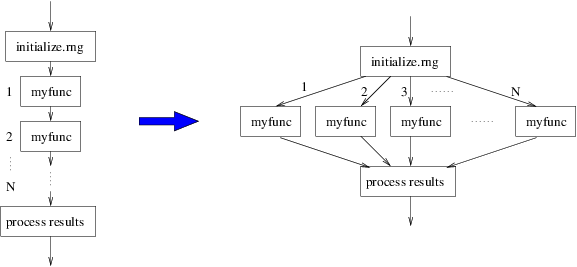
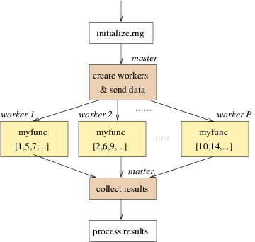
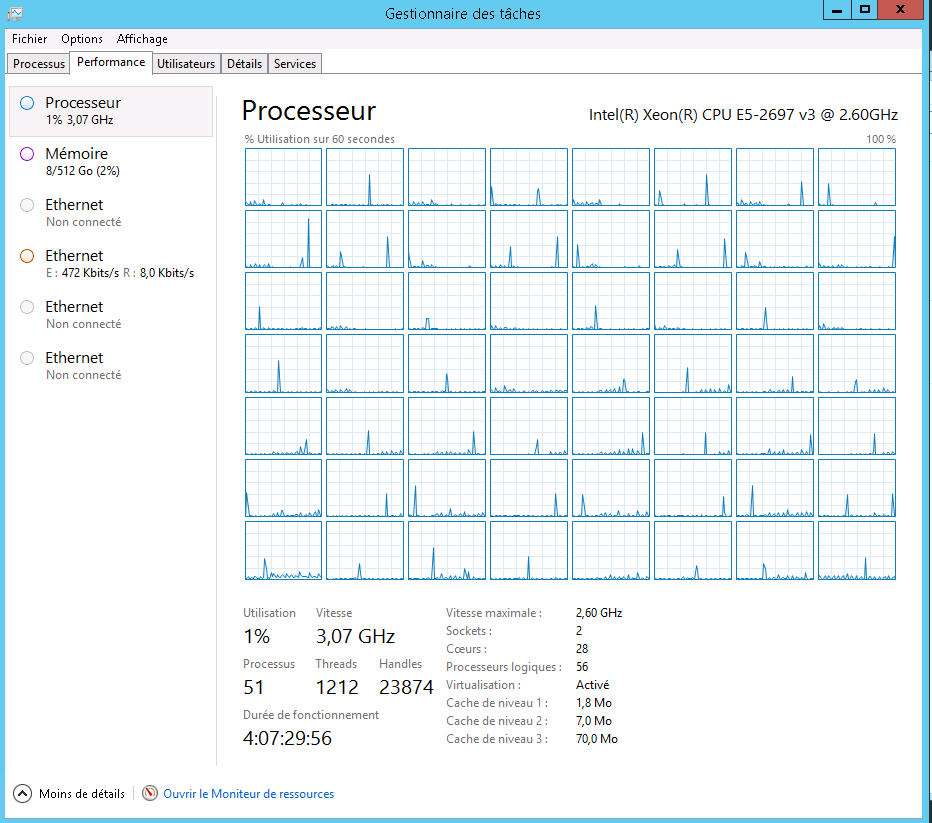

# Calcul parallèle


Nous allons voir dans ce chapitre le principe du calcul parallèle et une façon d'en faire avec **R**. Ce document est fortement inspiré du tutoriel suivant [Introduction to parallel computing with R](https://rawgit.com/PPgp/useR2017public/master/tutorial.html). Le lecteur pourra également consulter cette présentation très intéressante de Vicent Miele [Le calcul parallèle pour non-spécialistes,c'est maintenant!](http://rug.mnhn.fr/semin-r/PDF/semin-R_calcul-parallele_VMiele_160617.pdf)


Ce document a été généré directement depuis **RStudio** en utilisant l'outil Markdown. La version *.pdf* se trouve [ici](chapitre_3_avance.pdf).


**Packages à installer**

```{r, eval = F}
install.packages(c("parallel", "snow", "snowFT", "VGAM"), 
                 dependencies = TRUE)
```


## Principe du calcul parallèle

On suppose que nous ayons un calcul à réaliser qui aurait cette forme :

```{bash, eval = F}
initialize.rng(...) # on définit une séquence de graines pour tirage aléatoire
for (iteration in 1:N) {              # on répète N fois,  
    result[iteration] <- myfunc(...)  # la fonction myfunc() 
                                      # avec une valeur de graine différente par itération
}
process(result,...) # récupération des résultats 
```

**Exemple**: un exemple de programme ayant cette forme serait l'algorithme des forêts aléatoires, dans lequel *myfunc()* permettrait de coder un arbre de régression ou de classification sur un échantillon qui serait tiré différemment à chaque itération. A la fin de la boucle, on agrège en général les résultats des différents arbres pour faire de la prédiction. 


Si on ne précise rien, le calcul précédent sera effectué de façon séquentiel, autrement dit il faut attendre qu'une itération soit terminée pour passer à la suivante. L'idée du calcul parallèle est de permettre de lancer le calcul de la fonction *myfunc()*, en parallèle, comme le montre la figure suivante.



Avant de continuer à parler de calcul parallèle, rappelons la définition d'un processeur : "Le processeur ou CPU (Central Processing Unit) est le composant de votre ordinateur qui exécute les instructions qui lui sont données par votre système d'exploitation. Quand vous exécutez un logiciel, décompressez une archive ZIP ou regardez une vidéo en haute définition, vous faites travailler en priorité le processeur ! Pour répondre à vos demandes les plus exigeantes, le processeur peut être doté de plusieurs coeurs." (définition extraite de [ce site](https://lecrabeinfo.net/le-role-des-processeurs-et-de-leurs-coeurs.html))

Si un processeur ne possède qu'un seul coeur, il ne sera pas possible faire du calcul parallèle car les instructions seront traitées en série. Aujourd'hui, la plupart des machines sont dotées d'un processeur multi coeur, composé de deux ou plusieurs coeurs indépendants. Un processeur dual-core contient deux coeurs, un processeur quad-core quatre coeurs, etc. Sur la représentation graphique ci-dessous, on distingue bien les quatre coeurs du processeur. 


Pour savoir combien de coeurs on dispose sur notre machine, on peut utiliser la fonction *detectCores()* du package **parallel**: 

```{r}
library("parallel")
detectCores() # nombre de coeurs physiques
```

Cependant, un coeur peut lui-même se dédoubler : le nombre de tâches pouvant être exécuté correspond au nombre de "Thread" ou processeurs logiques. Pour connaître le nombre de Threads, on exécute la commande suivante : 

```{r}
detectCores(logical = TRUE) # nombre de Threads
```

Sur Windows, il y a en général deux fois plus de Threads que de coeurs physiques. Dans notre cas, c'est le nombre de Threads qui nous intéresse plus particulièrement et c'est ce dernier chiffre que nous utiliserons pour faire du calcul parallèle. Dans la suite du cours, j'utiliserai l'expression coeur pour définir un Thread.    

**Pour en savoir plus** sur les définitions des coeurs logiques et physiques, vous pouvez consulter cette page [wikipedia](
https://fr.wikipedia.org/wiki/Hyper-Threading)


## Notion de programme maître 

Dans l'exemple précédent, on a vu qu'on souhaitait répliquer *N* fois la fonction *myfunc()*, sachant que pour chaque itération, on utilise une valeur de graine différente (ce qui est logique sinon cela voudrait dire qu'on aurait $N$ fois le même résultat). Si $N$ est plus grand que le nombre de coeurs dont on dispose (ce qui est le plus souvent le cas), l'idée sera d'envoyer sur chaque coeur un certain nombre d'itération. Prenons par exemple $N=100$ et 4 coeurs, dans ce cas il semble naturel de répartir les tâches de la façon suivante : 

* le coeur 1 lancera les itérations 1, 5, 9, ... 93 et 97.
* le coeur 2 lancera les itérations 2, 6, 10, ..., 94 et 98.
* le coeur 3 lancera les itérations 3, 7, 11, ..., 95 et 99.
* le coeur 4 lancera les itérations 4, 8, 12, ..., 96 et 100

L'idée du programme maître est qu'il devra spécifier cette répartition des tâches. Autrement dit, il devra indiquer que la fonction *myfunc()* exécutera les itérations 1, 5, 9, ... 93 et 97 dans le coeur 1, les itérations 2, 6, 10, ..., 94 et 98 dans le coeur 2, etc. 

Une fois les tâches effectuées, l'autre rôle du programme maître est de bien récupérer les sorties du programme parallélisé et d'en faire en général une synthèse (calcul de moyenne, d'écart-types, etc.). 

On peut résumer ceci par la figure suivante : 




Il existe énormément de package permettant de faire du calcul parallèle. Nous utiliserons ici les packages **parallel** et **snow**.


## Fonction *set.seed()*

Quand on fait de l'échantillonage ou qu'on simule des échantillons de façon aléatoire, on peut avoir besoin de retrouver les mêmes tirages. C'est le cas notamment lorsqu'on présente des résultats dans un rapport et qu'on souhaite que les résultats soient reproductibles.

La fonction *set.seed()* est utilisée pour reproduire les mêmes tirages/échantillonages les uns à la suite des autres. Elle prend comme argument d'entrée un entier appelé **graine** ou "seed" qui est utilisée dans l'algorithme de simulation. En effet, la notion d'aléatoire au sens strict n'exite pas lorsqu'on fait de la simulation numérique. Dans la vraie vie, lorsqu'on tire une boule dans une urne (par exemple au tirage du loto), on comprend bien qu'il ne sera pas possible de tirer les mêmes boules deux fois de suite (si la condition d'aléatoire est bien respectée). En revanche, avec des simulations numériques, comme on utilise un algorithme dit pseudo-aléatoire, cela devient possible de répliquer un même tirage en utilisant le même nombre initial dans l'algorithme.   

La fonction *set.seed()* précède la fonction *sample()* ou tout autre fonction génératrice de lois de distribution connues (*rnorm()*, *runif()*, *rbinom()*, etc.). Par exemple, on souhaite faire à la suite : 

* un tirage aléatoire de 5 nombres dans une urne comprenant 49 boules avec des numéros allant de 1 à 49 example, 
* simuler un bruit blanc de taille 5

```{r}
set.seed(200907)
(loto <- sample(1:49, 5))
(white_noise <- rnorm(5))
```

Si on répète cette même syntaxe, on obtiendra systématiquement les mêmes résultats.

```{r}
set.seed(200907)
(loto <- sample(1:49, 5))
(white_noise <- rnorm(5))
```

Le lecteur trouvera plus d'informations sur la fonction *set.seed()* dans cette vidéo : https://www.youtube.com/watch?v=zAYzAZwufKI

**Application dans un algorithme de type "bootstrap"**

Dans le graphique suivant, on représente l'intérêt du bootstrap. 


Pour que cela fonctionne, il faut qu'à chaque simulation, on tire un échantillon différent. Autrement dit, il faut veiller à ne pas appliquer la fonction *set.seed()* à un nombre constant dans la boucle **for**. Dans l'exemple suivant, on calcule l'estimateur "bootstrap" de la moyenne de la variable **Sepal.Length** du jeu de données **iris**. Comme la graine est fixée, on va toujours tirer le même échantillon et on aura un estimateur biaisée.

```{r}
B <- 10
res_mean <- numeric(B)
for (b in 1:B) {
  set.seed(123)
  samp <- sample(1:nrow(iris), replace = T)
  res_mean[b] <- mean(iris[samp, "Sepal.Length"])
}
res_mean
```

**Solution:** pour corriger le programme ci-dessus, il suffit de remplacer la valeur de la graine 123 par l'objet **b** qui varie de 1 à B. 

**Exercice 3.1** 

On considère le modèle de régression suivant où les données **wage1** sont issues du package **wooldridge**:

$$log(wage)=\beta_0+\beta_1 educ + \epsilon$$

```{r, eval = F}
library(wooldridge)
log_wage_model <- lm(lwage ~ educ, data = wage1)
```

* Calculer un estimateur bootstrap de $\beta_0$ et $\beta_1$. On fixe le nombre de réplications à $B=1000$.

```{r, echo = F, eval = F}
B <- 1000
beta_0 <- numeric(B)
beta_1 <- numeric(B)
for(i in 1:B) {
    log_wage_model_b <- lm(lwage ~ educ, data = wage1[sample(1:nrow(wage1), replace = T), ])
    beta_0[i] <- coefficients(log_wage_model_b)[1]
    beta_1[i] <- coefficients(log_wage_model_b)[2]
}
```

* Representer l'histogramme des valeurs bootstrappées (un histogramme par coefficient), l'estimateur "bootstrap" de la moyenne et la vraie valeur. 

```{r, eval = F, echo = F, fig.width=10, fig.height=5}
par(mfrow = c(1, 2))
hist(beta_0)
abline(v = mean(beta_0), col ="red")
abline(v = coefficients(log_wage_model)[1], col ="blue", lty = 2)
hist(beta_1)
abline(v = mean(beta_1), col ="red")
abline(v = coefficients(log_wage_model)[2], col ="blue", lty = 2)
```

* Ecrire l'algorithme qui permette de faire la même chose en utilisant le calcul parallèle


## Syntaxe pour lancer un calcul parallèle

On considère la fonction suivante qui permet de calculer la moyenne d'un échantillon de taille **r** simulée selon une loi normale de paramètre **mean** et **sd**.

```{r}
myfun <- function(r, mean = 0, sd = 1) {
  mean(rnorm(r, mean = mean, sd = sd))
}
```

On souhaite répéter 100 fois cette fonction :

* 25 fois quand **r** vaut 10, 
* 25 fois quand **r** vaut 1000,
* 25 fois quand **r** vaut 100000,
* 25 fois quand **r** vaut 10000000,

avec **mean=5** et **sd=10**. 

### Syntaxe dans le cas non parallèle 

Pour répondre à la problématique posée, on va d'abord utiliser la fonction *sapply()* qui permet de répondre au problème de façon séquentielle. Autrement dit, elle va appliquer la fonction *myfun()* itération après itération sur les différentes valeurs de **r** qu'on donne dans le 1er argument de la fonction *sapply()*. D'abord, on créé le vecteur contenant les valeurs de **r** et on prépare aussi l'objet qui va contenir les résultats. 
  
```{r}
r_values <- rep(c(10, 1000, 100000, 10000000), each = 25)
resultats <- data.frame(r_values = factor(r_values))
```

On lance la fonction *sapply()* et on regarde le temps de calcul :

```{r}
time_sapply <- system.time(
  resultats$res_non_par <- sapply(r_values, FUN = myfun, 
                mean = 5, sd = 10) # options de la fonction myfun
)
time_sapply
```

### Syntaxe dans le cas parallèle 

Pour exécuter la fonction précédente dans le cas parallèle, la syntaxe est la suivante :   

```{r}
P <- 4  # définir le nombre de coeurs 
cl <- makeCluster(P) # réserve 4 coeurs - début du calcul 
time_par <- system.time(
 res_par <- clusterApply(cl, r_values, fun = myfun, # évalue myfun sur r_values  
                   mean = 5, sd = 10)  # options de myfun
)  
stopCluster(cl) # libère 4 coeurs - fin du calcul 
time_par
```

La syntaxe est donc pratiquement la même que dans le cas non parallèle. Il suffit simplement d'utiliser la fonction *makeCluster()* au début pour réserver le nombre de coeurs nécessaires et la fonction *stopCluster()* à la fin pour libérer les coeurs. De même, c'est la fonction *clusterApply()* qui permet de répartir la fonction *myfun()* vers les différents coeurs.   

Pendant l'execution d'un programe en parallèle, il est possible de vérifier que les coeurs sont en train de fonctionner en parallèle. Sur Windows, il suffit de cliquer sur le "Gestionnaire des tâches" pour voir l'état de l'utilisation des processeurs et/ou de la mémoire. 

 

### Recommandations

#### Gestion de la mémoire

Si vous parallélisez un programme qui utilise $x$ Go de RAM, vous allez a priori avoir besoin de *Px* Go de RAM où $P$ est le nombre de coeurs utilisés. Si dans le gestionnaire des tâches, vous vous rendez compte que vous utilisez un programme qui utilise $100\%$ de la mémoire RAM, cela aura pour effet de réduire considérablement les temps de calcul. 

#### En cas d'interruption du programme maître

Si vous quittez votre programme maître alors que le calcul parallèle est en train de tourner, dans ce cas il est probable que les coeurs alloués continuent de tourner même si votre session maître semble terminer (ceci peut se voir dans le "Gestionnaire des tâches" et "Processus", plusieurs processus **R** seront ouverts). Dans ce cas, il faudra penser à exécuter la fonction *stopCluster()*. Si cela n'est pas suffisant (les coeurs continuent à tourner), il faudra vraisemblablement tuer les process à la main (dans "Gestionnaire des tâches", puis "Processus", puis click droit sur les icônes "R for Windows" et "Fin de tâche").

#### Choix du nombre de coeurs

Ici, nous avons utilisé 4 coeurs sur les `r detectCores()` Threads disponibles de la machine, ce qui laisse un nombre considérable de coeurs libres. Sur une machine de type perso, il est d'usage de ne pas utiliser tous les coeurs disponibles afin d'en laisser un certain nombre de libres pour rendre le fonctionnement de la machine stable (qui doit en effet gérer d'autres processus que **R**). Sur un serveur dédié au calcul, il est a priori possible d'utiliser tous les coeurs disponible à cet usage.   

Le gain en temps de calcul n'est pas linéaire en fonction du nombre de coeurs utilisés. Cependant, dans l'exemple ci-dessus, en utilisant 4 coeurs plutôt qu'un seul, on a eu un facteur environ `r round(time_sapply[3] / time_par[3], 1)` de gain en temps calcul. On s'est amusé à refaire le même calcul que précédemment, mais en faisant évoluer le nombre de coeurs alloué. Pour chaque coeur, on a répliqué 10 fois le calcul pour avoir une distribution du temps de calcul. Dans la figure ci-dessous, on a représenté la courbe du temps de calcul en fonction du nombre de coeurs alloués. On constate que : 


```{r, echo = F, eval = F}
temps <- numeric(16 * 10)
P <- 1:16  # définir le nombre de coeurs 
i <- 1
for (p in P) {
  print(p)
  cl <- makeCluster(p) # réserve 4 coeurs - début du calcul 
  for (j in 1:10){
    temps[i] <- system.time(
      res_par <- clusterApply(cl, r_values, fun = myfun, # évalue myfun sur r_values  
                   mean = 5, sd = 10)  # options de myfun
    )[3]
    i <- i + 1
  }
 stopCluster(cl) # libère 4 coeurs - fin du calcul 
}
my_time <- data.frame(temps = temps, p = rep(1:16, each = 10))
save(my_time, file = "res_time.RData")
```

* la tendance est décroissante mais pas linéaire
* à partir de 5 coeurs, le temps gagné est de moins en moins significatif et on a une asymptote à partir de 10 coeurs. 


```{r, echo = F}
load("R/res_time.RData")
```

```{r, warning = F, echo = F}
library(ggplot2)
ggplot(my_time, aes(x = factor(p), y = temps)) +
  geom_boxplot() + 
  stat_summary(fun.y = "mean")+
  theme(legend.position = "none")
```

La raison est qu'en faisant du calcul parallèle, il y a des flux d'informations qui communiquent entre le programme maître et les coeurs sollicités et que ces flux coûtent du temps. Aussi, parfois il arrive que les flux d'informations coûtent plus en temps que les calculs à proprement dit. Autrement dit, il peut arriver que le calcul parallèle ait un effet négatif sur le temps...  Nous verrons un exemple plus tard.


### Récupérer les résultats 

En utilisant la fonction *sapply()* dans le cas non parallèle, le résultat est stocké sous forme d'un **array**. Avec la fonction *clusterApply()*, le résultat est stocké sous forme de **list**. Dans les exemples précédents, une façon de récupérer les résultats est donc la suivante : 

```{r}
resultats$res_par <- unlist(res_par)
```

On calcule ensuite la moyenne et l'écart-type en fonction des valeurs prises par **r_values**:

```{r}
aggregate(resultats[, 2:3], list(r_values = as.factor(resultats[, "r_values"])), 
          function(x) c(MEAN = mean(x), SD = sd(x)))
```

On peut également utiliser la syntaxe **tidyverse** : 

```{r, message = F}
require("dplyr")
resultats %>%
  group_by(r_values) %>%
  summarise_all(list(mean = mean, sd = sd))
```

Nous verrons un peu plus tard un équivalent de  *sapply()* en calcul parallèle qui permettra de récupérer les résultats sous forme simplifiée.  

### Utiliser des packages, objets, jeux de données sur les différents coeurs

Lorsqu'on lance un calcul en parallèle sur 4 coeurs, c'est comme si on ouvrait 4 nouvelles consoles **R**. Or, à l'ouverture d'une nouvelle console **R**, il n'y a par défaut aucun package ni objets chargés. C'est pourquoi si le programme fait appel à des librairies ou des objets, l'utilisateur devra le spécifier. 

#### Utiliser des packages sur plusieurs coeurs

On reprend la fonction précédente dans laquelle on aimerait changer la loi de distribution gaussienne par une loi de Pareto. La fonction *rpareto()* du package **VGAM** permet de faire cela. On a plusieurs possibilités pour programmer la fonction. 

**Solution 1 :** elle consiste à utiliser la fonction *library()* à l'intérieur de la fonction *myfun_pareto()*. Dans ce cas, si on lance un calcul en parallèle, la librarie sera chargée dans chaque coeur appelé.

```{r}
myfun_pareto <- function(r, scale = 1, shape = 10) {
  library("VGAM")
  mean(rpareto(r, scale = scale, shape = shape))
}
```

**Solution 2 :** elle consiste à utiliser la syntaxe suivante qui évite de charger toutes les fonctions du package **VGAM** mais qui indique dans quelle librairie il faut aller chercher la fonction *rpareto()*. 

```{r}
myfun_pareto <- function(r, scale = 1, shape = 10) {
  mean(VGAM::rpareto(r, scale = scale, shape = shape))
}
```

Dans les deux cas, lorsqu'on executera cette fonction en parallèle, chaque coeur saura où trouver la fonction *rpareto()*. Pour exécuter la fonction en parallèle :  

```{r, eval = FALSE}
r_values <- rep(c(10, 1000, 100000), each = 25)
cl <- makeCluster(P) 
res_par <- clusterApply(cl, r_values, fun = myfun_pareto, 
                    scale = 1, shape = 10) 
stopCluster(cl)  
```

**Solution 3 :** une façon alternative de procéder est d'écrire la fonction sans faire appel à la librairie **VGAM**.

```{r}
myfun_pareto <- function(r, scale = 1, shape = 10) {
  mean(rpareto(r, scale = scale, shape = shape))
}
```

En revanche, il faudra indiquer dans le programme maître, qu'on souhaite charger le package **VGAM** sur tous les coeurs que nous allons utiliser. Ceci se fait à l'aide de la fonction *clusterEvalQ()*. Voici un exemple d'utilisation :  

```{r, eval = F}
cl <- makeCluster(P) 

clusterEvalQ(cl, library("VGAM"))
res_par <- clusterApply(cl, r_values, fun = myfun_pareto, 
                    scale = 1, shape = 10) 

stopCluster(cl) 
```

#### Charger des objets, fonctions ou jeux de données dans les différents coeurs

On reprend l'exemple précédent dans lequel on modifie légèrement la fonction de telle sorte que les paramètres **scale** et **shape** ne sont pas reconnus en tant que variables locales. 

```{r}
myfun_pareto <- function(r) {
  mean(rpareto(r, scale = scale, shape = shape))
}
```

Pour que la fonction ne retourne pas de messages d'erreurs, il faudra donc que les objets **scale** et **shape** soient définis en tant que variables globales, et ceci dans chaque coeur.  Il est possible de faire cela, toujours grâce à la fonction *clusterEvalQ()* que nous avons utilisée précédemment. Dans l'exemple suivant, la librairie **VGAM** sera chargée dans chaque coeur et les objets **scale** et **shape** seront également définis.  

```{r, eval = F}
cl <- makeCluster(P) 

clusterEvalQ(cl, {
  library("VGAM")
  scale <- 1
  shape <- 10
  })
res_par <- clusterApply(cl, r_values, fun = myfun_pareto) 

stopCluster(cl) 
```

Une autre façon est de définir ces objets depuis la session maître : 

```{r}
scale <- 1
shape <- 10
```

puis d'exporter ces objets vers tous les coeurs qui seront utilisés dans la suite à l'aide de la fonction *clusterExport()* : 

```{r, eval = F}
cl <- makeCluster(P) 

clusterExport(cl, c("scale", "shape"))
clusterEvalQ(cl, library("VGAM"))
res_par <- clusterApply(cl, r_values, fun = myfun_pareto) 

stopCluster(cl) 
```

Cette méthode peut s'avérer intéressante pour exporter des jeux de données vers les différents coeurs. 


### Fonctions *lapply()*, *sapply()*, *apply()*, *mapply()*

Il existe des versions parallélisées de ces fonctions. Celles-ci sont nommées : 

* *parLapply()*, 
* *parSapply()*, 
* *parApply()*,
* *clusterMap()*.

Ces fonctions font appel à la fonction *clusterApply()*. Elles semblent en général un peu plus longue en temps de calcul mais permettent de simplifier la syntaxe de sortie (fonction *parSapply()*) ou d'utiliser des arguments différents en fonction de l'itération (fonction *clusterMap()*). 

**Exemple :** dans le premier exemple de ce chapitre, nous avons utilisé la fonction *sapply()* sur la fonction *myfun()* ainsi   

```{r, eval = F}
res_non_par <- sapply(r_values, FUN = myfun,
                      mean = 5, sd = 10) # options de la fonction myfun
```

Pour la version parallèle, on aurait pu remplacer simplement *sapply()* par *parSapply()* :  

```{r}
P <- 4  # définir le nombre de coeurs 
cl <- makeCluster(P) # réserve 4 coeurs - début du calcul 
system.time(
  res_par <- parSapply(cl, r_values, FUN = myfun, # évalue myfunc() sur r_values  
                    mean = 5, sd = 10) 
)  
stopCluster(cl) # libère 4 coeurs - fin du calcul 
```

**Remarque :** dans cet exemple, le gain en temps de calcul n'est pas aussi prononcé que lorsqu'on avait utilisé la fonction *clusterApply()* seul. Ceci peut s'expliquer par le fait qu'il y a des opérations supplémentaires avec la fonction *parSapply()*. Aussi, même si l'avantage ici est que le résultat est retourné sous forme de vecteur, on recommande d'utiliser la fonction *clusterApply()*.  


### Autres packages de calcul parallèle

* **snowFT** : ce package permet de gérer le choix des graines de simulation de façon optimale à l'intérieur de chaque coeur. Nous en présenterons un exemple à la fin de ce chapitre car son utilisation semble prometteuse. 

* **foreach** : ce package permet de faire des boucles de type **for** en utilisant une syntaxe similaire. Le but est de faire tourner en parallèle les instructions à l'intérieur de la boucle **for**. Ce package est en général couplé avec le package **doParallel**, via le package **parallel** (voir [vignette à ce lien](https://cran.r-project.org/web/packages/doParallel/vignettes/gettingstartedParallel.pdf)), dont on présente ci-dessous un exemple d'utilisation : 

```{r, eval = T, echo = T, message = F}
require("doParallel")
getDoParWorkers() # affiche nombre de coeurs alloué
registerDoParallel(cores = P) # alloue le nombre de coeurs souhaité
getDoParWorkers() # Pour vérifer qu'on utilise bien tous les coeurs

system.time(
  res_par_foreach <- foreach(i = r_values) 
   %dopar% myfun(i, mean = 5, sd = 10)
  )

# pour revenir au nombre de coeur initial 
registerDoParallel(cores = 1)

# présentation des resultats
resultats$res_par_foreach <- unlist(res_par_foreach)
```


```{r, eval = F, echo = F}
require("doParallel")
getDoParWorkers() # nombre de coeurs alloué
registerDoParallel(cores = detectCores()) # alloue tous les coeurs disponibles
getDoParWorkers() # Pour vérifer qu'on utilise bien tous les coeurs

res_par <- system.time(
  x <- foreach(i = 1:4, .combine=c) %dopar% simul_elec(n = 3, cas = "IC", B = 125000)
  )

#pour revenir au nombre de coeur initial 
registerDoParallel(cores=1)
```


* **doMPI** : utilise une architecture mpi.

Des temps de calcul ont été comparés entre ces différentes solutions (voir [Introduction to parallel computing with R](https://rawgit.com/PPgp/useR2017public/master/tutorial.html)), le package **parallel** est parmi ceux qui obtiennent les meilleurs résultats. 


**Exercice 3.2.**

Le bagging est une technique utilisée pour améliorer la classification notamment celle des arbres de décision. On va programmer l'algorithme suivant :

**Entrées :**

* **ech_test** l'échantillon test,
* **ech_appr** l'échantillon d'apprentissage,
* **B** le nombre d'arbres,

Pour $k = 1, ..., B$ :

1. Tirer un échantillon bootstrap dans **ech_appr**
2. Construire un arbre CART sur cet échantillon bootstrap et prédire sur l'échantillon test. 

On va appliquer cet algorithme sur le jeu de données **iris** qui est inclus dans **R** par défaut. L'objectif est de prédire à quel type d'espèce appartient une fleur (variable **Species** qui contient 3 variétés) en fonction de ses caractéristiques (variables **Sepal.Length**,  **Sepal.Width**,  **Petal.Length** et **Petal.Width**).  

Tout d'abord, on définit l'échantillon **ech_test** qui contient les observations à prédire. Ici, on en tire 25 au hasard et les 125 observations restantes constitueront l'échantillon d'apprentissage :

```{r}
set.seed(1)
id_pred <- sample(1:150, 25, replace = F)
ech_test <- iris[id_pred, ]
ech_appr <- iris[-id_pred,]
```

* Créer la fonction *class_tree()* qui prend comme argument d'entrée la valeur de la graine $k$ utilisée pour tirer un échantillon bootstrap de **ech_appr** (il s'agit simplement d'un tirage aléatoire avec remise appliquée après la fonction *set.seed(k)*), va constuire un arbre CART sur cet échantillon bootstrap  et retournera la prédiction sur l'échantillon test **ech_test**. On pourra utiliser les fonctions *rpart()* et *predict.rpart()*, mais l'objet retourné sera un vecteur de **character** contenant l'espèce prédite.  

```{r, eval = T, echo = F}
class_tree <- function(k) {
  # sample the observations
  set.seed(k)
  ech_test_bootstrap <- ech_appr[sample(1:125, replace = T), ]
  # sample the variable
  res_rf <- rpart(Species ~ ., data = ech_test_bootstrap)
  # prediction 
  return(
    c("setosa", "versicolor", "virginica")[max.col(predict(res_rf, newdata = ech_test))])
}
```

Le résultat de cette fonction est le suivant :
```{r, message = F}
require("rpart")
class_tree(1)
```

* A présent, nous allons répéter 100 fois cette opération en effectuant du calcul parallèle. Pour cela, on aura besoin d'exporter dans les différents coeurs la librairie **rpart** et les objets suivants **ech_test**, **ech_appr**: 


```{r, message = F, echo = F, eval = F}
cl <- makeCluster(P) 

clusterExport(cl, c("ech_test", "ech_appr"))
clusterEvalQ(cl, library("rpart"))

res_par <- clusterApply(cl, 1:100, fun = class_tree) 
stopCluster(cl) 
```

* Récupérer les données et donner les valeurs prédites pour chaque observation de l'échantillon test. 


```{r, echo = F, eval = F}
# Pour récupérer les données, on créé d'abord un tableau contenant pour chaque valeur à prédire le résultat des 100 simulations : 
tab_res_par <- sapply(res_par, function(x) x)
# Pour chaque observation à prédire, on regarde la répartition des prédictions : 
prop_res_par <- apply(tab_res_par, 1, function(x) 
  c(length(which(x == "setosa")), 
    length(which(x == "versicolor")), 
    length(which(x == "virginica"))))
prop_res_par 
# On prédit par la variété qui a été prédite le plus de fois parmi les 100 réplications : 
pred_vecteur <- apply(prop_res_par, 2, function(x) c("setosa", "versicolor", "virginica")[which.max(x)])
# On compare avec les vraies valeurs : 
(tab_res <- table(pred_vecteur, ech_test$Species))
```

* Calculer le tableau de bien classés
```{r, echo = F, eval = F}
# Pour obtenir le pourcentage de bien classé : 
sum(diag(tab_res))/sum(tab_res)
```


## Equilibrer la répartition des tâches

En envoyant plusieurs tâches dans différents coeurs, il se peut que certains coeurs soient plus sollicités que d'autres. On considère la fonction suivante qui consiste à calculer la moyenne d'un échantillon de taille **r** simulée selon une loi gaussienne. 

```{r}
rnmean <- function(r, mean = 0, sd = 1) {
        mean(rnorm(r, mean = mean, sd = sd))
}
```

Nous allons appliquer cette fonction en utilisant des valeurs de **r** qui soient très hétérogènes de telle sorte qu'on va créer un déséquilibre dans l'exécution des tâches. 

```{r}
N <- 40
set.seed(50)
r.seq <- sample(ceiling(exp(seq(7, 14, length = 50))), N)
r.seq
```

Si on parallèlise sur 4 coeurs, comment vont se répartir l'envoi des tâches sur les coeurs ? Cela va se faire automatiquement de la façon suivante : 

* le coeur 1 va effectuer le calcul pour les valeurs de **r** suivantes : 162755 (1ère position de **r.seq**), 29311 (5ème position de **r.seq**), 1266 (9ème position de **r.seq**), etc.
* le coeur 2 va effectuer le calcul pour les valeurs de **r** suivantes : 22027 (2ème position de **r.seq**), 1460 (6ème position de **r.seq**), 1942 (10ème position de **r.seq**), etc.
* le coeur 3 va effectuer le calcul pour les valeurs de **r** suivantes : 3967 (3ème position de **r.seq**), 79676 (7ème position de **r.seq**), 9348 (11ème position de **r.seq**), etc.
* le coeur 4 va effectuer le calcul pour les valeurs de **r** suivantes : 187749 (4ème position de **r.seq**), 51904 (8ème position de **r.seq**), 4576 (12ème position de **r.seq**), etc.

On constate que le 1er coeur va d'abord commencer à simuler un vecteur de taille 162755 alors que le second coeur va simuler un vecteur de taille 22027. Le second coeur devrait donc être monopolisé moins de temps que le premier. On peut alors se poser la question s'il va passer au calcul de sa seconde valeur à calculer une fois le premier calcul terminé.   

Il est possible de faire un rapport de l'usage des coeurs grâce à la fonction *snow.time()* du package **snow**. 

```{r, message = F}
library("snow")
cl <- makeCluster(P) 
ctime1 <- snow.time(clusterApply(cl, r.seq, fun = rnmean))
plot(ctime1, title = "Usage with clusterApply")
stopCluster(cl) 
```

Dans le graphique ci-dessus, les traits en vert correspondent à des périodes où un coeur $i$ ($i = 1, \ldots, 4$ en ordonnée) est en train d'effecture un calcul. Un trait bleu correspond à une période où le coeur est en repos. Aussi, on constate que dans un coeur donné, pour passer à l'exécution d'une nouvelle tâche, il faut attendre que toutes les instructions effectuées sur les coeurs en parallèle soient terminées. Autrement dit, le coeur 2 a du attendre que le coeur 1 ait terminé l'exécution de sa première tâche avant de pouvoir passer à la tâche suivante. Ceci n'est donc pas optimale. 


Une alternative à la fonction *clusterApply()* est d'utiliser la fonction *clusterApplyLB()* qui a été optimisée pour cet usage. On constate ci-dessous que toutes les tâches n'ont plus besoin d'avoir été exécutées avant de passer aux suivantes. 

```{r}
cl <- makeCluster(P) 
ctimeLB <- snow.time(clusterApplyLB(cl, r.seq, fun = rnmean))
plot(ctimeLB, title = "Usage with clusterApplyLB")
stopCluster(cl) 
```

Le gain en temps de calcul est d'un facteur `r round(ctime1$elapsed / ctimeLB$elapsed, 1)`.  


**Remarque :** dès lors que nous avons chargé la librairie **snow**, ce sont les fonctions *clusterApply()* et *clusterApplyLB()* du package **snow** qui ont été utilisées alors qu'elles existent simultanément dans les packages **snow** et **parallel**. Elles sont quasiment équivalentes d'un package à un autre, mais pour garder en mémoire le rapport sur l'usage des coeurs, il faut utiliser les fonctions du package **snow**.  

## Améliorer la répartition des tâches

Dans l'exemple précédent, on a vu qu'il y avait sans arrêt des flux d'information entre le programme maître et les coeurs car on a 40 calculs ou 'jobs' qui sont envoyés au fur et à mesure dans les coeurs alloués. Une façon de déjouer cela est de re-travailler le programme maître pour indiquer que les 10 premières tâches seront envoyées dans le 1er coeur, les 10 suivantes dans le second, etc. Pour cela, on modifie d'abord la fonction *rnmean()* afin qu'elle puisse s'appliquer avec **r** défini comme un vecteur, plutôt qu'un scalaire :

```{r}
rnmean_vect <- function(r, mean = 0, sd = 1) {
        sapply(r, 
         function(x) mean(rnorm(x, mean = mean, sd = sd)))
}
```

Ensuite, on transforme le vecteur **r.seq** en liste composée de 4 sous vecteurs.

```{r}
r.seq_list <- list(r.seq[1:10],
                   r.seq[11:20],
                   r.seq[21:30],
                   r.seq[31:40])
```

Enfin, on refait appel à la fonction 

```{r}
library("snow")
cl <- makeCluster(P) 
ctime <- snow.time(clusterApply(cl, r.seq_list, fun = rnmean_vect))
plot(ctime, title = "Usage with clusterApply")
stopCluster(cl) 
```

A travers cet exemple, on voit que les flux d'informations sont minimes et le temps de calcul par conséquent meilleur avec une amélioration d'un facteur `r round(ctime1$elapsed / ctime$elapsed, 1)`.  

**Exercice 3.3.**

En vous inspirant de cette section, améliorer la fonction  *class_tree()* vue précédemment en la vectorisant. Le but est de ne faire que 4 jobs (25 bootstrap par job) au lieu de 100. Comparer le temps de calcul avec la version non vectorisée.

## Fonction vectorisée VS calcul // VS code **C++**

Faire du calcul // n'est pas nécessairement bénéfique si celui-ci n'est pas utilisé dans les règles de l'art. Dans cette section, on va comparer plusieurs façons de coder le même problème. 

On considère le jeu de données suivant qui prend un peu moins d'1 Go de mémoire vive (10M d'observations et 3 variables). 

```{r, eval = F}
n <- 10000000 
big_file <- data.frame(chiffre = 1:n,
                       lettre = paste0("caract", 1:n), 
                       date = sample(seq.Date(as.Date("2017-10-01"),
                                        by = "day", len = 100), n,
                                     replace = T))
object.size(big_file)
```

```{r, echo = F}
load(file = "R/big_file.RData")
object.size(big_file)
```


L'objectif est de créer une nouvelle variable binaire qui vaut 1 si la variable **chiffre** est paire est 0 sinon. Pour cela, on va comparer plusieurs moyens pour y arriver.

**Solution 1 :** on va utiliser la fonction *ifelse()* qui s'applique sur la fonction **%%**. 

```{r, eval = T}
sol_1 <- microbenchmark::microbenchmark({
  big_file$new <- ifelse(big_file$chiffre %% 2 == 0, 1, 0) 
}, times = 10L
)
```


**Solution 2 :** on va utiliser les opérateurs d'affectation et la fonction **%%**

```{r, eval = T}
sol_2 <- microbenchmark::microbenchmark({
  big_file$new <- as.numeric(big_file$chiffre %% 2 == 0)  
}, times = 10L
)
```

**Solution 3 :** on va utiliser du calcul // avec la fonction *foreach()*. D'abord, on créé la fonction à paralléliser qui regarde si un chiffre est pair ou non :

```{r}
compare <- function(x)
  x %% 2 == 0 
```

Ensuite, on parallélise avec la fonction *foreach()* (ici, sur les 1000 premières valeurs uniquement car le temps de calcul serait trop long sur l'ensemble des individus) :

```{r, eval= F}
require("doParallel")
P <- 4 
registerDoParallel(cores = P) 
system.time(
  res <- foreach(i = 1:1000) %dopar% 
    compare(big_file$chiffre[i])
)
```

Dans cet exemple, on a mal programmé la parallélisation comme cela a été vue dans la section 1.6. On va donc re-programmer la fonction à paralléliser pour indiquer que l'on souhaite faire le calcul des 2500000 premières observations sur le 1er coeur, les 2500000 suivantes sur le second coeur, etc. Comme la fonction *compare()* est déjà vectorisée, ce n'est pas la peine de la changer. En revanche, on change l'appel de la fonction *foreach()* afin de l'adapter à ce que l'on souhaite faire :

```{r}
require("doParallel")
sol_3 <- microbenchmark::microbenchmark({
registerDoParallel(cores = P) 
res <- foreach(i = 1:4) %dopar% 
  compare(big_file[(1 + 2500000 * (i - 1)):(2500000 * i),                           "chiffre"])
}, times = 10L
)
```

**Solution 4 :** on va utiliser du code **C++**


```{Rcpp}
#include <Rcpp.h>
using namespace Rcpp;
  
// [[Rcpp::export]]
IntegerVector compare_cpp(IntegerVector x) {
    int n = x.size();
    IntegerVector res(n);
    
    for(int i = 0; i < n; i++) {
      if(x(i) % 2 == 0) {
      res(i) = 1;
      } else {
      res(i) = 0;
      }
    }
    
    return res;
}
```

```{r, eval = T}
require("Rcpp")
sol_4 <- microbenchmark::microbenchmark(
  big_file$new <- compare_cpp(big_file$chiffre),
  times = 10L)
```

Représentons les performances de ces 4 solutions :
```{r}
time_mbm <- rbind(sol_1, sol_2, sol_3, sol_4)
time_mbm$expr <- paste0("solution", rep(1:4, each = 10))
ggplot2::autoplot(time_mbm)
```


Si on compare les 4 solutions, c'est celle qui utilise **C++** qui est la plus performante. Souvent, lorsqu'un programme compte un grand nombre de boucles, c'est effectivement cette solution qui est la meilleure. Ici, le calcul // (à condition que la méthode soit bien implantée) donne des résultats équivalents à la solution 2 qui utilise la commande **%%**. Il n'y a pas d'améliorations à utiliser du code // ici car les flux d'informations entre le programme maître et les coeurs sont importants (en effet, on transfère une grosse quantité de données). Enfin, on constate que la solution 1 prend quant à elle plus de temps que la solution 2 car la fonction *ifelse()* contient pas mal de codes internes. 


## Reproductibilité des résultats : choix de la graine aléatoire

Il est de plus en plus souvent demander aux programmeurs de coder de telle sorte que leur résultats soient reproductibles par d'autres sur n'importe quelle machine. Lorsqu'on fait des simulations, il est possible de fixer une graine avec la fonction *set.seed()*, mais ceci n'est valable que sur la machine ``maître''. Ainsi, on peut exécuter autant de fois que l'on souhaite l'instruction suivante, cela donnera des résultats différents à chaque fois car des tirages différents ont été réalisés à chaque itération. 

```{r}
cl <- makeCluster(P) 
res_par <- parSapply(cl, 1:100, function(x) mean(rnorm(100)))
stopCluster(cl) 
```

Une façon de régler ce problème est de fixer une graine à l'intérieur de la fonction qu'on parallèlise (comme ce qui a déjà été fait précédemment) : 

```{r}
rnmean <- function(x, r, mean = 0, sd = 1) {
  set.seed(x)
  mean(rnorm(r, mean = mean, sd = sd))
}

cl <- makeCluster(P) 
res_par <- parSapply(cl, 1:100, rnmean, 
                     r = 100, mean = 0, sd = 1)
stopCluster(cl) 
```

Une autre façon de faire est d'utiliser la fonction *performParallel()* du package **snowFT** qui gère parfaitement la gestion des graines aléatoires et fait en sorte d'attribuer dans chaque coeur des graines qui pourront être reproduites.  
 
```{r, message = F}
rnmean <- function(r, mean = 0, sd = 1) {
        mean(rnorm(r, mean = mean, sd = sd))
}

library("snowFT")
seed <- 1
r_values <- rep(c(10, 1000, 100000, 10000000), each = 10)
res <- performParallel(P, r.seq, fun = rnmean, 
                seed = seed)
tail(unlist(res))
```

**Remarque :** cette fonction permet également de définir ou exporter des objets/librairies vers les différents coeurs en utilisant les options **initexpr** et **export**. En reprenant l'exemple précédent avec la fonction *myfun_pareto()* : 

```{r, message = F}
myfun_pareto <- function(r) {
  mean(rpareto(r, scale = scale, shape = shape))
}

seed <- 1
scale <- 1
shape <- 10
r_values <- rep(c(10, 1000, 100000, 10000000), each = 10)

res <- performParallel(P, r.seq, fun = myfun_pareto, 
                seed = seed,
                initexpr = require("VGAM"),
                export = c("scale", "shape"))
tail(unlist(res))
```


