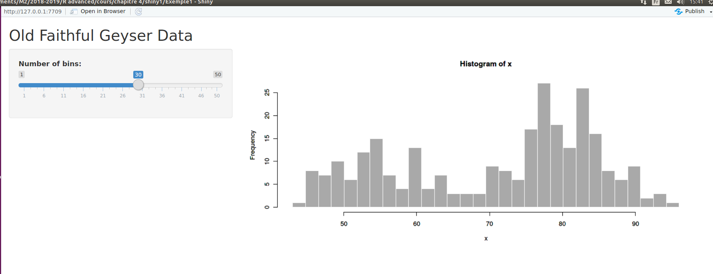

# Visualisation de données


**Packages à installer**

Depuis le CRAN : 

```{r, eval = F}
install.packages(c("devtools",      # devtools
                   "dplyr",         # piping
                   "gapminder",     # données gapminder
                   "ggcorrplot",    # graphiques corrélation
                   "ggridges",      # données ggridges
                   "ggplot2",       # graphiques ggplot2
                   "ggpol",         # jitter et boxplot
                   "kableExtra"     # tableaux customisés 
                   "RColorBrewer",  # couleurs 
                   "stargazer",     # tableaux 
                   "survival",      # modèle de survie
                   "survminer",     # plot de survie
                   "plotly",        # graphiques interractifs 
                   "vcd",           # mosaic plot
                   "visreg"),        # effets conditionnels des modèles
                 dependencies = TRUE)
```


## Fonctions graphiques de base VS **ggplot2** 

Il est possible de réaliser des graphiques statistiques sous **R** de multiples façons. Même si de nombreuses fonctions provenant de différents packages font la même chose, deux stratégies semblent se dégager pour réaliser des graphiques statistiques :

* utiliser les fonctions de base *plot()*, *hist()*, *barplot()*, *boxplot()*, etc. conjointement avec les fonctions de bas-niveau *lines()*, *text()*, *legend()* pour ``ornementer'' le graphique  et la fonction *par()* pour modifier les paramètres graphiques (marges, taille de la fenêtre graphique, taille des légendes, etc.). 

* utiliser la philosophie du package **ggplot2** proposée par H. Wickham. 

En général, les utilisateurs décident d'adopter l'une ou l'autre façon de faire, rarement les deux. L'idée de cette section est d'essayer de faire une revue des avantages de l'un et de l'autre et si possible déterminer à quel moment il est intéressant d'utiliser l'un plutôt que l'autre. 

La stratégie a été la suivante : une grande majorité des utilisateurs de **ggplot2** choisissent d'utiliser ce package parce que celui-ci leur permet de réaliser des graphiques élégants en modifiant le moins possible les paramétrages par défaut. On va donc partir de graphiques obtenus avec **ggplot2**, supposés "élégants" et essayer d'obtenir des graphiques équivalents en utilisant la syntaxe de base.   

Cette section est fortement inspirée de cette page : 

* https://flowingdata.com/2016/03/22/comparing-ggplot2-and-r-base-graphics/

Pour une introduction aux graphiques de base et au package **ggplot2** :

* http://www.thibault.laurent.free.fr/cours/R_intro/chapitre_4.html

### Graphiques standards 

Par graphique standard, on entend les graphiques de type diagrame en barre, histogramme, nuage de points, boîtes à moustaches parallèles, etc. Dans le contexte où on compare les fonctions graphiques de base à celles du package **ggplot2**, les graphiques standards seront opposés à des graphiques de types "conditionnels". Les graphiques conditionnels correspondent à des graphiques standards qu'on va réaliser conditionnellement à une variable souvent qualitative.  

#### Diagramme en barre 

On va commencer par un diagramme en barre. On va utiliser les données **diamonds** qui sont incluses dans le package **ggplot2** et qui donnent des informations sur la vente de plus de 50000 diamants. Parmi les variables observées, le prix, le carat, la qualité de la coupe, la couleur, etc. 

```{r}
require("ggplot2")
data("diamonds")
```

On rappelle qu'avec **ggplot2**, les commandes s'enchaînent avec l'opérateur **+**. La première opération consiste à spécifier le jeu de données sur lequel on travaille (fonction *ggplot()*). Ensuite, on spécifie le nom de la variable qui nous intéresse (avec la fonction *aes()*). Une des spécificités de l'univers **tidyverse** est qu'une fois le nom du **data.frame** spécifié, il suffit d'appeler directement les variables par leurs noms, sans préciser à quelle **data.frame** elles appartiennent. 

Enfin, on donne la fonction correspondant au graphique que l'on souhaite représenter. Pour un diagramme en barre, cela se fait avec la fonction *geom_bar()*. Si on souhaite utiliser des couleurs différentes par barre, une façon de le faire sans avoir à spécifier aucun nom de couleur, consiste à ajouter dans la fonctions *aes()* l'option **fill=** suivi du nom d'une variable qualitative que l'on souhaite représenter. Il peut s'agir de la même variable pour laquelle on souhaite tracer des barres, mais il peut aussi s'agir d'une autre variable (dans ce cas, chaque barre sera découpée par étages selon les modalités de la seconde variable).  

```{r}
ggplot(diamonds) +
  aes(x = cut) +
  geom_bar(stat = "count") + 
  xlab("Degré de qualité") +
  ylab("Effectifs") +
  ggtitle("Effectifs des diamants par degré de qualité")
  
```

Pour représenter un diagramme en barres avec les graphiques de base, on a besoin de construire une table de contingences associée à une variable qualitative. 

```{r}
tab_cut <- table(diamonds$cut)
```

Une des caractéristiques de **ggplot2** est de représenter des lignes verticales et horizontales pour aider à la lecture du graphique. Pour faire cela avec les graphiques de base, on peut utiliser la fonction *grid()* qui précise le nombre de barres horizontales et verticales à représenter ou bien utiliser la fonction *abline()* qui donne les coordonnées où tracer les droites. Pour représenter la graduation de l'axe des ordonnées horizontalement, on utilise l'option **las=1** dans les paramatrès généraux de la fonction *par()*. 

```{r}
par(las = 1)
barplot(tab_cut,
        col = "#AFC0CB",
        border = FALSE,
        main = "Effectifs des diamants par degré de qualité",
        xlab = "Degré de qualité",
        ylab = "Effectifs",
        cex.axis = 0.8)
abline(h = seq(0, 20000, by = 2500), col = "lightgray", lty = "dotted")
```

Pour ce type de graphique, il n'y a pas de gros écarts en termes de nombre de lignes de codes entre les deux styles de graphique. 

**Remarque :** en revanche, pour reproduire exactement le même graphique (fond en gris, marges, etc.) en utilisant une syntaxe de base, cela demanderait un peu plus de travail. On le fait ici pour le **barplot** pour que l'utilisateur se rende compte des lignes de codes qui sont implicitement exécutées dans l'appel de fonctions de type **ggplot2** :

```{r}
op <- par(mar = c(3, 3.2, 0.5, 0.5), # marge
          mgp = c(1, 0.5, 0),        # emplacement annot/étiquettes/légendes
          oma = c(0, 0, 1, 0),       # emplacement pour le titre
          cex.axis = 0.75, # tailles des anotations
          cex.lab = 0.85, # tailles des légendes
          pch = 16,       # type de point utilisé
          las = 1,      # affiche les étiquettes |_ aux axes 
          bty = "n"    # pas de box
          ) 
plot.new()
plot.window(xlim = c(0.5, 5.5), ylim = c(0, max(tab_cut)))
  
rect(par()$usr[1], par()$usr[3], 
     par()$usr[2], par()$usr[4], 
     col = "grey89", border = "white")

abline(h = seq(0, 25000, 2500), col = "white")
abline(v = seq(1, 5, 1), col = "white")

barre.x <- c(0.55, 1.45)

for (k in 0:4)
  rect(barre.x[1] + k, 0, barre.x[2] + k, tab_cut[k + 1], 
       col = "grey19", border = "grey19")

axis(side = 1,
     at = seq(1, 5, 1),  # ou mettre les graduations
     labels = c("Fair", "Good", "Very Good", "Premium", "Ideal"), # quelles étiquettes
     lwd = 0,  # supprime la ligne de l'axe des abscisses
     lwd.ticks = 0.25)  # donne l'épaisseur des graduations
mtext("Degré de qualité", 1, line = 1.5)
axis(side = 2,
     at = seq(0, 25000, 5000),
     labels = seq(0, 25000, 5000),
     lwd = 0, 
     lwd.ticks = 0.25,
     cex = 0.8)  
mtext("Effectifs", 2, line = 2.2, las = 3)
mtext("Effectifs des diamants par degré de qualité", 3, 
      line = -0.25, las = 1, outer = T, adj = 0)
```


#### Séries temporelles

On va considérer une série temporelle mensuelle, supposons qu'il s'agit d'un indice boursier aggrégé mensuellement : 

```{r}
serie <- c(161.31, 154.00, 161.94, 160.23, 173.20, 170.21, 163.97, 161.70, 
           144.91, 145.31, 140.50, 139.58, 135.60, 124.40, 132.24, 150.51, 
           146.56, 153.00, 151.78, 160.65, 158.32, 158.06, 153.50, 161.95, 
           167.00, 175.00, 180.48, 173.82, 160.05, 152.80, 153.58, 145.00, 
           142.98, 145.35)
```

Pour associer des dates à ces valeurs, nous allons utiliser le type d'objet **Date**. On utilise ici une méthode générique de la fonction *seq()* appliquée à des dates : 

```{r}
date_serie <- seq(as.Date("2015/1/1"), by = "month", length.out = 34)
```

Pour représenter cette série avec **ggplot2**, il faut d'abord créer un **data.frame** :

```{r}
serie_df = data.frame(date_serie = date_serie, serie = serie)
```

Ensuite, il suffit d'utiliser de préciser dans la fonction *aes()* que la variable **date_serie** est associée à **x** et la variable **serie** à **y**. C'est la fonction *geom_line()* qui indique qu'on va relier les points par des lignes brisées :

```{r}
ggplot(serie_df) +             
  aes(x = date_serie, y = serie) + 
  geom_line(linetype = 2, colour = "blue")  + 
  xlab("Mois observés") +
  ylab("Indice boursier") +
  ggtitle("Evolution de l'indice boursier")
```

En utilisant les graphiques de base, cela se fait assez bien car le format **Date** est également reconnu par la fonction générique *plot()*. On obtient donc un résultat similaire avec seulement quelques lignes de code supplémentaire.

```{r}
par(las = 1)
plot(serie ~ date_serie, data = serie_df, 
     type = "l", 
     col = "royalblue", 
     lty = 2,
     main = "Evolution de l'indice boursier",
     xlab = "Mois observés",
     ylab = "Indice boursier",
     cex.axis = 0.8)
abline(h = seq(130, 180, by = 10), 
       v = date_serie[seq(1, 32, 6)],
       col = "lightgray", lty = "dotted")
```

#### Histogramme et fonction de densité 

Pour représenter un hstogramme et une densité avec **ggplot2**, cela se fait avec les fonctions *geom_histogram()* et *geom_density()*.  L'option **bins=** dans la fonction *geom_histogram()* permet de donner le nombre de barres. L'option **adjust =** permet d'ajuster le degré de lissage de la foncion non paramétrique de la densité. Pour ajouter la fonction paramétrique d'une loi gaussienne, on utilise la fonction *stat_function()* : 

```{r}
ggplot(diamonds) +
  aes(x = price) +
	geom_histogram(aes(y = ..density..), fill = "lightblue", colour = "black", 
	               bins = 30) + 
	geom_density(colour = "red", 
	             adjust = 2) +
  stat_function(fun = dnorm, 
    args = c(
      mean = mean(diamonds$price), 
      sd = sd(diamonds$price))) + 
  xlab("Prix observé") +
  ggtitle("Distribution de la variable prix")
```

En utilisant les fonctions de base, on peut reproduire quelque chose d'équivalent sans que cela soit trop coûteux. A noter toutefois que l'option **nclass=** de la fonction *hist()* ne donnera pas nécessairement exactement le nombre de classes souhaité, car un algorithme est utilisé pour déterminer ce nombre.  

```{r}
par(las = 1, cex.axis = 0.8, cex.lab = 0.8)
hist(diamonds$price, freq = F, col = "lightblue", nclass = 30, 
     xlab = "Prix du diamant", main = "Distribution de la variable prix")
lines(density(diamonds$price), col = "red")
x_seq <- seq(-1000, 20000, by = 100)
lines(x_seq, dnorm(x_seq, mean(diamonds$price), sd(diamonds$price)))
abline(h = seq(0, 0.0005, by = 0.00005), 
       v = seq(0, 20000, by = 2500), 
       col = "lightgray", lty = "dotted")
```


#### Nuage de points

Afin d'avoir des représentations graphiques moins lourdes, on va se restreindre à un sous-échantillon de taille 5000. En effet, pour certains graphiques, lorsque le nombre d’observations est important, sa lecture devient difficile.

```{r}
set.seed(123) # on fixe une graine aléatoire 
diam_ech <- diamonds[sample(nrow(diamonds), 5000, replace = F), ]  
```

Pour représenter un nuage de points et une droite de régression non paramétrique, cela se fait dans **ggplot2** avec les fonctions *geom_point()* et *geom_smooth()*. Cette dernière permet de tracer une droite de régression linéaire (option **method="lm"**) ou alors une droite de régression non paramétrique (option **method="loess"**), basée sur les modèles GAM (Hastie et Tibshirani, 1986). Un intervalle de confiance est également représenté par défaut pour cette dernière méthode.    

```{r}
ggplot(diam_ech) +                # on va chercher des variables dans diam_sample
  aes(x = carat, y = price) +     # on s'intéresse aux 2 variables carat et price
  geom_point() +                  # on représente un nuage de points
  geom_smooth(method = "loess") + # on ajoute une droite de rég. non paramétrique
  geom_smooth(method = "lm",      # on ajoute une droite de régression linéaire
              col = "red") + 
  xlab("Carat") +
  ylab("Prix observé") +
  ggtitle("Lien entre deux variables quantis")
```

En utilisant les fonctions de base, il faut passer par les fonctions *lm()* pour calculer les coefficients de la droite de régression linéaire et la fonction *loess()* permet d'obtenir une droite de régression non paramétrique basée quant à elle sur la méthode des polynômes locaux. Pour représenter une droite de régression non paramétrique basée sur la méthode GAM, le lecteur pourra se référer au package **gam**. 

```{r}
par(las = 1, cex.axis = 0.8, cex.lab = 0.8)
plot(price ~ carat, data = diam_ech, pch = 16, cex = 0.7, 
     xlab = "carat", ylab= "prix", main = "Lien entre deux variables quantis")
abline(lm(price ~ carat, data = diam_ech), col = "red", lwd = 3)
# values to predict
x_carat <- seq(0, 4.5, 0.01)
lines(x_carat,  
      predict(loess(price ~ carat, data = diam_ech), 
              data.frame(carat = x_carat)), 
      col = "blue", lwd = 3)
abline(h = seq(0, 20000, by = 5000), 
       v = seq(0, 4, by = 0.5), 
       col = "lightgray", lty = "dotted")
```

#### Boîtes à moustaches parallèles  

Avec **ggplot2**, les boîtes à moustaches parallèles se font à partir de la fonction *geom_boxplot()* :

```{r}
ggplot(diam_ech) +              
  aes(x = color, y = price) +  
  geom_boxplot() 
```

Pour obtenir un graphique similaire avec les fonctions de base, on peut utiliser la fonction *boxplot()* :

```{r}
par(las = 1, cex.axis = 0.8, cex.lab = 0.8)
boxplot(price ~ color, data = diam_ech, pch = 16, cex = 0.7, 
     xlab = "carat", ylab= "prix")
abline(h = seq(0, 20000, by = 2500), 
       v = seq(0, 5, by = 1), 
       col = "lightgray", lty = "dotted")
```


**Conclusion :** pour des graphiques "standards", on constate donc que le match "fonctions de base" VS "fonctions **ggplot2**" n'a pas vraiment de gagnants. Par ailleurs, ici nous sommes restés sur des graphiques simples avec un minimum d'onrnementations. Le package **ggplot2** repose sur une représentations de données de type **data.frame**; du coup, pour faire certains ajouts tels que des points particuliers, des lignes brisées ou des étiquettes, cela peut s'avérer plus compliqué que d'utiliser simplement les fonctions graphiques de base. Malheureusement, il n'est pas possible de combiner les fonctions graphiques de base avec les fonctions du package **ggplot2**.        


### Graphiques conditionnels 

Un avantage du package **ggplot2** sur les fonctions graphiques de base repose sur la très bonne gestion des graphiques conditionnels. Les graphiques conditionnels correspondent à des graphiques standards qu'on va réaliser conditionnellement à une variable souvent qualitative.  

Il y a deux façons de faire un graphique conditionnel : 

* on va afficher dans un même graphique une information relative aux modalités d'une variable qualitative (ex : dans un nuage de points, on va représenter une droite de régression associée à chacune des modalités d'une variable qualitative).

* on va faire autant de graphiques qu'il existe de modalités d'une variable qualitative (ex : on va faire un histogramme d'une variable quantitative pour chaque modalité d'une variable qualitative).


```{r, echo = F, fig.width = 12}
p1 <- ggplot(diam_ech) +
  aes(x = price, color = cut) + 
  geom_density() + 
  labs(title = "Conditionnel type 1")
p2 <- ggplot(diam_ech) +
  aes(x = price) + 
  geom_density() +
  facet_wrap(~ cut) + 
  labs(title = "Conditionnel type 2")
gridExtra::grid.arrange(p1, p2, ncol = 2)
```

####  Utilisation des options **fill=** et **colour=** 

L'utilisation des options **fill=** et **colour=**  à l'intérieur de la fonction *aes()* ou des fonctions de type *geom_XXX()*, vont permettre de réaliser le premier type de graphique.

##### Fonctions de densités 

On souhaite savoir si la distribution de la **price** est la même selon les modalités prises par la variable qualitative **cut**. Pour ce faire, on va ajouter l'option **fill=** dans la fonction *aes()* suivie du nom de la variable qualitative. L'option **fill=** permet de remplir chaque courbe de densité par une couleur prédifinie dans **ggplot2**. Si on avait utilisé l'option **colour=**, on aurait obtenu uniquement des traits de couleurs différentes. L'option **alpha=** permet quant à elle de définir le degré de transparence des couleurs. 


```{r}
ggplot(diam_ech) + 
  aes(x = price, fill = cut) + 
  geom_density(alpha = 0.5)
```

Pour réaliser un tel graphique en utilisant les fonctions de base, cela nécessite de réaliser les étapes suivantes : 

* découper la variable quantitative en fonction des modalités, ceci pouvant se faire avec la fonction *split()*, 

* appliquer la fonction *density()* sur chaque sous-échantillon, 

* ouvrir une fenêtre graphique en définissant correctement les marges, 

* représenter une courbe de densité par modalité en utilisant une couleur pour chaque courbe à définir (pour obtenir les mêmes couleurs que celles obtenues proposées dans **ggplot2**, on pourra voir ce lien : https://stackoverflow.com/questions/8197559/emulate-ggplot2-default-color-palette).


```{r, message = F}
# on splite la variable price en fonction de carat 
list_price <- split(diam_ech$price, diam_ech$cut)
# on applique la fonction density à chaque sous-groupe
list_density <- lapply(list_price, density)
# on ouvre la fenêtre graphique avec les paramètres optimaux
par(las = 1, cex.axis = 0.8, cex.lab = 0.8)
plot(range(unlist(lapply(list_density, function(l) range(l$x)))),
     range(unlist(lapply(list_density, function(l) range(l$y)))),
     type = "n",
     xlab = "prix",
     ylab = "densité")
# choix d'une palette de couleurs 
col_pal <- c("#F8766D", "#A3A500", "#00BF7D", "#00B0F6", "#E76BF3")
# application de la fonction lines() sur chaque élément de la liste
dont_print <- mapply(lines, list_density, 
       col = col_pal, lwd = 2)
abline(h = seq(0, 4*10^(-4), by = 10^(-4)), 
       v = seq(0, 25000, by = 5000), 
       col = "lightgray", lty = "dotted")
legend("topright", legend = names(list_density),
       col = col_pal, lwd = 2, cex = 0.8)
```

**Conclusion :** on voit donc que **ggplot2** a très bien pris en compte la représentation de graphiques conditionnellement à une variable qualitative. Un autre atout est la gestion des paramètres graphiques par défaut (de type couleur, légende, etc). C'est pour ces deux raisons que **ggplot2** rencontre un tel succès. Il est important de souligner que derrière l'utilisation de toutes ces fonctions, se cachent des tas de lignes de codes qui rendent possibles cette utilisation simplifiée. 

**Remarque :** pour remplir les aires sous les courbes de densités avec les graphiques de base, on aurait pu utiliser la fonction *polygon()* 

##### Nuages de points 
  
L'utilisation d'une variable qualitative conditionnelle peut s'avérer très intéressante à utiliser sur un nuage de points, pour savoir notamment si le lien entre les variables quantitatives $Y$ et $X$ sont les mêmes en fonction d'une variable qualitative. Ici on a changé la palette de couleur en utilisant les palettes de couleurs inspirés du package **RColorBrewer** (voir la note suivante concernant les palettes de couleurs style **RColorBrewer** : https://www.nceas.ucsb.edu/~frazier/RSpatialGuides/colorPaletteCheatsheet.pdf). 

```{r}
ggplot(diam_ech) + 
  aes(x = carat, y = price) + 
  geom_point() + 
  geom_smooth(aes(colour = cut)) + # ajoute 5 courbes selon la variable cut
  theme_bw() +                     # modifie la couleur de fond
  xlab("Carat") +                  # modifie la légende de l'axe des x
  ylab("price (in USD)") +         # modifie la légende de l'axe des y
  ggtitle("Lien entre deux variables quantis") +   # ajoute un titre
  scale_colour_brewer(name = "Qualité",   # modifie la légende de cut
                    labels = c("A--", "A-", "A", "A+", "A++") , # Etiquette
                    palette = "Greens")   # modifie la palette de couleurs 
```

Pour réaliser un graphique équivalent avec les fonctions graphiques de base, il faut procéder comme on l'a fait dans l'exemple précédent. On splite dans un premier temps le **data.frame** en fonction de la variable qualitative, on applique ensuite les fonctions *predict()* et *loess()* aux sous-échantillons avant de représenter les courbes les unes après les autres en utilisant les couleurs choisies. 


```{r}
par(las = 1, cex.axis = 0.8, cex.lab = 0.8)
plot(price ~ carat, data = diam_ech, pch = 16, cex = 0.7, 
     xlab = "carat", ylab= "price (in USD)", 
     main = "Lien entre deux variables quantis")
abline(h = seq(0, 20000, by = 5000), 
       v = seq(0, 4, by = 0.5), 
       col = "lightgray", lty = "dotted")
# on split le data.frame en fonction de cut 
list_df <- split(diam_ech, diam_ech$cut)
# values to predict
x_carat <- seq(0, 4.5, 0.01)
# on applique la fonction lowess à chaque sous-groupe
list_loess <- lapply(list_df, function(obj) 
  predict(loess(price ~ carat, data = obj),
          data.frame(carat = x_carat)))
# choix d'une palette de couleurs 
require("RColorBrewer")
col_pal <- brewer.pal(length(list_price), "Greens")
# application de la fonction lines() sur chaque élément de la liste
dont_print <- mapply(lines, rep(list(x_carat), 5), list_loess, 
       col = col_pal, lwd = 3)
legend("topright", legend = c("A--", "A-", "A", "A+", "A++"),
       col = col_pal, lwd = 2, cex = 0.8)
```


##### Boîtes à moustaches  

Pour réaliser des boîtes à moustache parallèles conditionnelement à une variable qualitative, cela se fait en seulement 3 lignes de codes avec **ggplot2**. 

```{r}
ggplot(diam_ech) +              
  aes(x = color, y = price, fill = cut) +  
  geom_boxplot() 
```

La fonction par défaut *boxplot()* permet de faire quelque chose de similaire en paramétrant suffisament bien les options. Pour afficher la boîte de légendes en-dehors du cadre, on a utilisé l'option **xpd=T** et modifié le paramètre de la marge à droite.  

```{r}
 # choix des couleurs :
col_pal <- c("#F8766D", "#A3A500", "#00BF7D", "#00B0F6", "#E76BF3")
par(las = 1, cex.axis = 0.8, cex.lab = 0.8,
    xpd = T, mar = par()$mar + c(0, 0, 0, 4))
boxplot(price ~ cut + color, data = diam_ech,
        xlab = "color", ylab = "price",
        at = c(1:5, 7:11, 13:17, 19:23, 25:29, 31:35, 37:41),
        col = rep(col_pal, 7), 
        pch = 16,
        xaxt = "n")
axis(1, at = c(3, 9, 15, 21, 27, 33, 39),
     labels = c("D", "E", "F", "G", "H", "I", "J"))
abline(h = seq(0, 20000, by = 2500), col = "lightgray", lty = "dotted")
legend(45, 15000, legend = c("A--", "A-", "A", "A+", "A++"),
       fill = col_pal)
```


#### Utilisation des facet

L'utilisation des fonctions de type *facet_XXX()* dans **ggplot2** permet de créer autant de fenêtre graphiques qu'il y a de modalités dans la variable conditionnelle. 

Si on reprend l'exemple précédent de la distribution conditionelle de la variable **price** en fonction de la variable **cut**, plutôt que de représenter toutes les distributions dans la même fenêtre graphique, on peut vouloir représenter chaque distribution dans une fenêtre graphique différente. Cela se fait avec les fonctions de type *facet_XXX()*.

```{r}
ggplot(diam_ech) +
  aes(x = price) + 
  geom_density() +
  facet_wrap(~ cut)
```

Réaliser le type de graphique ci-dessus avec les fonctions de base de **R** devient extrêmement compliqué : il faut d'abord découper la fenêtre en 6, puis utiliser une boucle **for** pour appeler la fonction *plot()* dans chaque sous-compartiment, etc.. Avant l'arrivée du package **ggplot2**, le package **lattice** qui fait partie des packages de base, permet également de faire des graphiques conditionnels en quelques lignes de codes. Ici, nous ne présentons pas d'exemples d'utilisation de ce package, mais le lecteur pourra trouver des exemple de comparaison entre **ggplot2** et **lattice** dans ce document : 

* https://www.londonr.org/wp-content/uploads/sites/2/presentations/LondonR_-_lattice_vs_ggplot2_-_Richard_Pugh_and_Andy_Nicholls_-_20130910.pdf


**Exercice 4.1**

* Trouver le code en syntaxe **ggplot** qui permette d'obtenir le grahique suivant obtenu en syntaxe de base:

```{r, eval = T}
op <- par(oma = c(1, 1, 0, 1), las = 1)
boxplot(Sepal.Length ~ Species, data = iris)
points(as.numeric(iris$Species) + rnorm(150, 0, 0.1), iris$Sepal.Length)
points(c(1, 2, 3), tapply(iris$Sepal.Length, iris$Species, mean), 
 col = "red", pch = 16, cex = 2)
par(op)
```

* Trouver le code en syntaxe de base qui permette d'obtenir le graphique suivant obtenu avec la syntaxe **ggplot**:

```{r, eval = T}
data("diamonds")
ggplot(diamonds, 
       aes(x = carat,
           y = price)) + 
  geom_point() + 
  ggtitle("My scatter plot")
```

## Présentation de graphiques originaux

On présente ici une liste de graphiques originaux, la plupart inspirée de la syntaxe **ggplot2**, mais pas uniquement.

### Mélange boîte à moustache/diagramme de dispersion

Le graphique suivant (issu du package **ggpol**) permet de représenter une "demi" boîte à moustache et un diagramme de dispersion à la place de la demi boîte. Le diagramme de dispersion n'est pas représenté sur une unique droite. En effet, si plusieurs valeurs sont identiques, il n'est pas possible de les distinguer sur une droite. C'est pourquoi les données ne sont pas toutes représentées sur la même droite (elles sont **jitter** en anglais). L'intérêt de ce graphique est limité, mais il permet toutefois d'apprécier le volume de données correspondant à chaque partie de la boîte à moustache. 

```{r}
library("ggpol")
ggplot(diamonds, 
       aes(x = cut, 
           y = price, 
           fill = cut)) +
  geom_boxjitter(color = "black",
     jitter.color = "darkgrey",
     errorbar.draw = TRUE) +
  theme_minimal() +
  theme(legend.position = "none")
```

### Violin plot

Le but de ce graphique est de représenter sur un même graphique une boîte à moustache et un estimateur non paramétrique de la densité. L'objectif est de visualiser sur un même graphique les informations spécifiques apportées par l'un et par l'autre. Plus précisément la boîte à moustache est intéressante pour visualiser les valeurs extrêmes alors que l'estimateur non paramétrique de la densité permet d'avoir une idée de l'allure de la distribution.

L'estimation non paramétrique est représentée verticalement (alors que celle-ci est généralement représentée horizontalement); de plus, il y a un effet miroir dans le but d'harmoniser le dessin avec la boîte à moustache. Dans l'exemple ci-dessous, on a représenté le "violin plot" de la variable **price** en fonction des modalités de la variable **cut**.


```{r}
ggplot(diamonds, 
       aes(x = cut, 
           y = price)) +
  geom_violin(fill = 
          "cornflowerblue") +
  geom_boxplot(width = .2, 
        fill = "orange",
        outlier.color = "orange",
        outlier.size = 2) + 
  labs(title = "Price dist. by cut")
```


### Ridgeline plots

Ce graphique (issu du package **ggridges**) est particulièrement intéressant car il permet de visualiser des estimateurs non paramétriques de densité conditionnement à une variable qualitative. Contrairement à un des graphiques vue dans la section précédente, il est possible d'apprécier correctemment la forme de chaque estimateur car ceux-ci sont représentés sur une ligne différente, tout en conservant la même échelle. 

```{r, message = F}
library(ggridges)
ggplot(diam_ech, 
       aes(x = price, 
           y = color, 
           fill = color)) +
  geom_density_ridges() + 
  theme_ridges() +
  labs("Price by levels color") +
  theme(legend.position = "none")
```


### Barres d'erreurs

Le graphique suivant permet de représenter sur un graphique les barres d'erreurs correspondant aux intervalles de confiance à $95\%$ autour des moyennes observées, en utilisant l'hypothèse de normalité. Attention, cela ne remplace pas un test statistique, mais cela permet d'apprécier visuellement si deux moyennes observées semblent significativement différentes l'une de l'autre.  

Pour réaliser ce graphique, il faut d'abord mettre en forme les données à la **ggplot2**, c'est-à-dire sous forme de **data.frame**, correctement disposé (**tidy**). 

```{r, message = F}
library(dplyr)
plotdata <- diamonds %>%
  group_by(color, cut) %>%
  summarize(n = n(),
         mean = mean(price),
         sd = sd(price),
         se = sd / sqrt(n),
         ci = qt(0.975, df = n - 1) * sd / sqrt(n))
```

Ensuite, on peut représenter les différentes moyennes et les barres d'erreurs. 

```{r}
ggplot(plotdata, aes(x = cut,
                     y = mean, 
                     group = color, 
                     color = color)) +
  geom_point(size = 3) +
  geom_line(size = 1) +
  geom_errorbar(aes(ymin = mean - se, 
                    ymax = mean + se), 
                width = .1)
```

### Cleveland dot chart

Le Cleveland dot chart est un graphique qui permet de visualiser une variabe quantitative de façon brute. On représente en général en ordonnées l'identifiant d'une observation (comme une marque de voiture, un pays, etc.) et en abscisse la valeur observée. Cet outil est particulièrement intéressant lorsque les observations sont triées. Cela permet d'apprécier un ordre de grandeur des différences observées.  

Dans l'exemple ci-dessous, les données proviennent du package **gapminder** sur les espérances de vie observées dans les pays d'Asie en 2007. 

```{r}
data(gapminder, package = "gapminder")

library(dplyr)
plotdata <- gapminder %>%
  filter(continent == "Asia" & 
         year == 2007)
ggplot(plotdata, 
       aes(x = lifeExp, 
           y = reorder(country, 
                   lifeExp))) +
  geom_point()
```


### Area chart

Ce graphique est intéressant pour représenter des données de composition (autrement dit des variables dont la somme est constante) qui évoluent au cours du temps. Dans l'exemple ci-dessous, on a représenté des parts de marché qui écoluent au cours du temps. 

```{r}
time_chart <- data.frame(
  year = rep(c(2000, 2005, 2010), each =3),
  market_share = c(20, 50, 30,
                   30, 50, 20,
                   50, 30, 20),
  comp = rep(c("a", "b", "c"), 3)
)

ggplot(time_chart, 
  aes(x = year,
      y = market_share,
      fill = comp)) +
  geom_area(color = "black") +
  labs(title = "Market share",
       subtitle = "2000 to 2010",
       x = "Year",
       y = "percentage",
       fill = "Company") +
  scale_fill_brewer(palette = "Set2") +
  theme_minimal()
```

### Correlation plot

Le graphique de corrélation permet d'apprécier le degré de corrélation entre plusieurs variables. Ce graphique provient du package **ggcorrplot** et a été profondémment épuré. On en effet, une matrice de corrélation est symétrique et constante sur la diagonale; par conséquent, on ne peut garder que l'information provenant de la partie supérieure (ou inférieure). C'est ce que fait le graphique suivant. 

```{r}
library(ggcorrplot)
r <- cor(iris[, 1:4], use = "complete.obs")
ggcorrplot(r, 
           hc.order = TRUE, 
           type = "lower",
           lab = TRUE)
```


### Représenter les effets des variables explicatives 

Dans ce paragraphe, nous allons voir des graphiques qui permettent de réprésenter certaines informations provenant de modèles statistiques. 

#### Régression linéaire 

La fonction *visreg()* du package **visreg** permet de représenter les effets d'une variable explicative sur la variable à expliquer. Pour cela, on représente sur le nuage de points les valeurs prédites avec une doite bleue. On notera que pour calculer les valeurs prédites à partire du modèle estimé, les autres variables du modèle sont prises constantes et égales à la médiane pour les variables quantitatives et au mode pour les variables qualitatives (plus de détails sur : https://journal.r-project.org/archive/2017/RJ-2017-046/RJ-2017-046.pdf).    

```{r}
library(visreg)
res_lm <- lm(Sepal.Length ~ 
 Sepal.Width + Petal.Width + Species,
 data = iris)
visreg(res_lm, "Sepal.Width",
       gg = TRUE) 
```

Pour les variables qualitatives, les valeurs prédites sont représentées par des traits bleus sur des diagrames de dispersion conditionnels aux modalités de la variable explicative. 

```{r}
visreg(res_lm, "Species",
       gg = TRUE) 
```

#### Régression logistique 

Une façon de représenter les résultats d'une régression logistique est de représenter la probabilité que l'événement d'intérêt $Y=1$ arrive, conditionnelement à une variable explicative. C'est ce que fait la fonction *visreg()* dans un modèle de régression logistique.  

```{r}
iris$binary <- factor(ifelse(iris$Species == "setosa", 1, 0))
res_glm <- glm(binary ~ 
 Sepal.Length,
 family = binomial(link = "logit"),
 data = iris)
```

```{r}
visreg(res_glm, "Sepal.Length", 
       gg = TRUE, 
       scale="response")
```


#### Modèle de survie 

Dans un modèle de survie, on peut être intéresser de représenter la fonction estimée de survie en fonction du temps et conditionnellement à une variable qualitative (dans l'exemple ci-dessous le sexe). C'est ce que fait le package **survminer**. Le package **survival** permet de faire les estimations du modèle. 

```{r, message = F}
library(survival)
library(survminer)
data(lung)
sfit <- survfit(Surv(time, status) ~  sex, data=lung)
ggsurvplot(sfit, 
  conf.int = TRUE, 
  pval = TRUE,
  legend.labs = c("M", "F"), 
  legend.title = "Sex",
  palette = c("cornflowerblue", "indianred3"),
  title = "Kaplan-Meier",
  xlab = "Time (days)")
```

### Mosaic plot

Le mosaic plot permet de représenter le croisement de modalités de variables qualitatives. Il permet notamment de vérifier quels sont les croisements qui sont en sur ou sous effectifs par rapport à une situation où les deux variables seraient indépendantes. 

```{r}
library(vcd)
tab <- xtabs(~cut + color, diamonds)
mosaic(tab, 
       shade = TRUE,
       legend = TRUE)
```

**Exercice 4.2**

* Sur les données **lung** utilisées précédemment, réaliser un "mosaic plot" entre les variables  **status** et **sex**.

```{r, eval = F, echo = F}
tab <- xtabs(~ status + sex, lung)
mosaic(tab, shade = TRUE, legend = TRUE)
```

* Toujours sur les données **lung**, réaliser un graphique de type "ridge plot" sur la variable variable **age** en fonction des modalités de la variable **status**.

```{r, eval = F, echo = F}
ggplot(lung) +
  aes(x = age, y = factor(status), fill = factor(status)) +
  geom_density_ridges() + 
  theme_ridges() +
  labs("Age by death/live") +
  theme(legend.position = "none")
```

* Réaliser un graphique des corrélations sur les variables **ph.karno**, **pat.karno**, **meal.cal**, **wt.loss** du jeu de données **lung**. 

```{r, eval = F, echo = F}
r <- cor(lung[, 7:10], use = "complete.obs")
ggcorrplot(r, hc.order = TRUE, type = "lower", lab = TRUE)
```


## Présenter des tableaux de résultats

Lorsqu'on présente un tableau de résultats (par exemple les résultats d'une régression) dans un document de type rapport ou présentation, il est préférable de ne pas insérer les sorties de **R** à l'état brut. D'une part, l'esthétique du format de sortie n'est pas agréable à lire et d'autre part, si on prend par exemple les sorties de la fonction *lm()*, il y a énormément de valeurs qu'on ne prend pas la peine de commenter en général.

Plutôt que de faire du copier/coller des chiffres qui nous intéressent depuis **R**, il existe un certain nombres de fonctions dans **R** qui retournent du code, par exemple html ou LaTeX, prêt à être insérer directement dans un document de type html ou LaTeX. 

L'utilisation de ce type de fonctions est facilitée dans les fichiers **R** Markdown. En effet, on peut utiliser l'option **results = 'asis'** dans un chunk pour indiquer que le résultat retourné sera dans le format du document de sortie (soit html si le document final est en html, soit LaTeX si le document final est pdf).


### La fonction $kable()$

Il s'agit d'une fonction incluse dans le package **knitr**, qui est le package permettant de compiler des fichiers Sweave ou **R** Markdown dans plusieurs formats de sortie. Cette fonction s'applique sur des objets de type **matrix** ou **data.frame**. Pour l'utiliser dans **R** Markdown, il suffit de faire : 

```{bash, eval = F}
# ```{r, results = 'asis'}
# knitr::kable(mtcars)
# ```
```

Ce qui produira le résultat suivant. Ici, on a ajouté l'option **echo = F** dans le chunk pour ne pas afficher le code **R** :

```{r, results='asis', echo = F}
knitr::kable(mtcars, format = "html")
```

Il existe un certain nombre d'options dans la fonction $kable()$ : 

* **digits=** définit le nombre de chiffres décimales à afficher, 

* **align=** ('r', right, 'l', left ou 'c', center) indique la position des valeurs à l'intérieur des cellules.

* **caption=** ajoute une légende. 


Une amélioration de la fonction *kable()* est la fonction *kbl()* du package **kableExtra**. Celle ci permet de représenter les valeurs dans un tableau avec des couleurs et/ou des tailles de police différentes. Par ailleurs, en cherchant un peu plus loin, il est également possible d'insérer des images ou des petits graphiques statistiques dans les cellules du tableau (voir la page suivante pour plus d'informations [lien](https://cran.r-project.org/web/packages/kableExtra/vignettes/awesome_table_in_html.html).)

On représente ici les 5 premières lignes du jeu de données **iris**:
```{r, message = F, eval = F}
library(kableExtra)
vs_dt <- iris[1:5, ]
vs_dt[1:4] <- lapply(vs_dt[1:4], function(x) {
    cell_spec(x, bold = T, color = spec_color(x, end = 0.9),
              font_size = spec_font_size(x))
})
vs_dt[5] <- cell_spec(vs_dt[[5]], color = "white", bold = T,
    background = spec_color(1:5, end = 0.9, option = "A", direction = -1))
kbl(vs_dt, escape = F, align = "c") %>% kable_classic("striped", full_width = F)
```


### La fonction $stargazer()$

La fonction $stargazer()$ du package **stargazer** est un plus général que la fonction *kable()* car elle prend en compte non seulement des objets de type **matrix** et **data.frame**, mais aussi **lm**.  

On l'utilise ainsi dans un document **R** Markdown :

```{bash, eval = F}
# ```{r, results = 'asis'}
# stargazer::stargazer(attitude)
# ```
```

#### Table de données brutes

Pour afficher une table de données brutes, on utilise la fonction *stargazer()*. Parmi les nombreuses options de cette fonction, on en cite ici quelques-unes : 

* **summary=F** signifie que la table doit être représentée à l'état brut (par défaut, la fonction  appliquée à un **data.frame** va faire un résumé statistique du **data.frame**), 

* **digits=1** indique qu'un seul chiffre après la virgule sera représenté, 

* **type=** indique le format dans lequel la table sera retournée, par exemple **"latex"** (par défaut) ou **"html"**. 

* **header=F** précise de ne pas ajouter la date, l'heure, etc. à laquelle la table a été crée,

* **rownames=F** précise de ne pas afficher le nom des lignes,

* **title=** permet de donner un titre à la table, 

Dans **R** Markdown, on a ajouté dans le chunck l'option **results = 'asis'** pour indiquer que **R** allait ressortir un résultat qui est dans le format du support de sortie utilisé (que ce soit *html* ou *latex*)  

```{r, results = 'asis', warning=FALSE, message=FALSE}
stargazer::stargazer(head(iris), summary = F, digits = 1, type = "html", 
          header = F, rownames = F, title = "Tableau de données"
          )
```


#### Tableau de résumé 

Par défaut, la fonction va créer un tableau de résumé statistique : 

```{r, results = 'asis', warning=FALSE, message=FALSE}
stargazer::stargazer(iris, type = "html", nobs = FALSE, mean.sd = TRUE, 
                     median = TRUE, iqr = TRUE, header = F,  title = "Résumé",
                     digit.separate = c(3, 3, 1, 1, 1, 1, 1))
```

#### Tableaux de régression 

Un des gros avantages de la fonction *stargazer()* est qu'elle permet de synthétiser des modèles de régression. 

```{r}
output_1  <- lm(Sepal.Length ~ Species, data = iris)
output_2  <- lm(Sepal.Length ~ Sepal.Width, data = iris)
```

```{r, results = 'asis', warning=FALSE, message=FALSE}
stargazer::stargazer(output_1, output_2, type = "html", 
                     title = "Résultat de régression", header = F)
```

Elle permet également de comparer des modèles entre eux. Pour en savoir plus, on pourra consulter le document suivant : 

* https://www.jakeruss.com/cheatsheets/stargazer/#html-formatting


**Exercice 4.3** 

Insérer dans un document Markdown :

* le tableau de corrélation des variables quantitatives du jeu de données **iris**. 

* le tableau de régression du jeu de données **iris** 


## Graphiques interactifs 

### Via **plotly**

```{r, message = F}
require("plotly")
```

Ici, nous allons présenter quelques exemples d'utilisations du package **plotly** qui permet de faire des graphiques interactifs en utilisant une interface web via la bibliothèque [plotly.js](https://plot.ly/javascript/) écrite en JavaScript.  

Il ne s'agit ici que d'une brève introduction, le lecteur pourra consulter le lien suivant pour plus d'informations : 

* https://plot.ly/r/

Lorsqu'on utilise les fonctions de ce package depuis **RStudio**, la fenêtre graphique qui s'ouvre depuis **RStudio** rend possible l'interactivité. Cela a pour effet de créer un graphique dans lequel il est possible d'obtenir des informations supplémentaires lorsqu'on place le curseur sur des zones de celui-ci.

De plus, lorsqu'on intègre ce type de graphique dans un document **R** Markdown, cela garde l'interactivité dans la page html créée.

Son utilisation est la suivante : on appelle la fonction *plot_ly()* dans lequel : 

* le 1er argument est le nom du jeu de données,

* l'argument **x = ~** donne le nom de la variable d'intérêt,

* l'argument **color = ~** donne le nom d'une variable conditionnelle,

* l'argument **type =** donne le type de graphique qu'on souhaite représenter. 

Par exemple, pour une boîte à moustache, on utilise la syntaxe suivante : 

```{r}
p <- plot_ly(diam_ech, x = ~price, color = ~cut, type = "box")
```

```{r, eval = T}
p
```

```{r, echo = F, eval = F}
export(p, file = "plotly_boxplot.png")
```

<!-- -->;


Pour un nuage de points, on utilise la syntaxe suivante : 

```{r, message = F, warning = F}
p <- plot_ly(diam_ech, x = ~carat, y = ~price, type = "scatter", mode = "markers",
             hoverinfo = 'text',
             text = ~paste('Carat: ', carat,
                      '\n Price: ', price,
                      '\n Clarity: ', diam_ech$clarity),
             color = ~carat)
```

```{r, eval = T}
p
```

```{r, echo = F, eval = F}
export(p, file = "plotly_scatter.png")
```

<!-- -->;

On peut si on le souhaite coupler les graphiques **ggplot2** avec l'interactivité de **plotly**. Pour cela, on peut reprendre n'importe lequel des graphiques présentés dans la section précédente et utiliser la fonction *ggplotly()* pour rendre possible l'interaction : 


```{r}
p <- ggplot(diam_ech) +              
  aes(x = color, y = price) +  
  geom_boxplot() 
```

```{r, eval = T}
ggplotly(p)
```

```{r, echo = F, eval = F}
export(ggplotly(p), file = "plotly_ggplot.png")
```

<!-- -->;


Autres packages permettant de faire des graphiques intercatifs : 

* **ggvis** : voir par exemple https://ggvis.rstudio.com/

* **rCharts** voir par exemple https://ramnathv.github.io/rCharts/


### Via **D3**

"D3.js (ou D3 pour Data-Driven Documents) est une bibliothèque graphique **JavaScript** qui permet l'affichage de données numériques sous une forme graphique et dynamique. Il s'agit d'un outil important pour la conformation aux normes **W3C** qui utilise les technologies courantes **SVG**, **JavaScript** et **CSS** pour la visualisation de données" (définition donnée par Wikipedia).

Il existe un certain nombre de packages **R** qui permettent de créer des graphiques en D3. Parmi ces packages, on nommera  **r2d3** (voir https://rstudio.github.io/r2d3/ pour plus d'informations).

On présente ici un exemple provenant d'un autre package (**networkD3**), qui permet de représenter des donnéds de flux.

```{r, eval = T}
library(networkD3)
hairColourData <- matrix(c(11975, 1951, 8010, 1013, 5871, 10048, 16145, 990,
                           8916, 2060, 8090, 940, 2868, 6171, 8045, 6907),
                         nrow = 4)
chordNetwork(Data = hairColourData, width = 500, height = 500,
             colourScale = c("#000000", "#FFDD89", "#957244", "#F26223"),
             labels = c("red", "brown", "blond", "gray"))
```


## Mini-introduction à **shiny** 

**shiny** est un package développé par **RStudio** qui permet la création de pages web interactives, sans avoir à connaître ni HTML, ni CSS, ni JavaScript.

On renvoit le lecteur vers la page web **RStudio** (http://shiny.rstudio.com/gallery/) pour voir des exemples d'applications réalisées avec **shiny**.

Pour utiliser **shiny**, cela se fait de manière exrêmement intuitive depuis **RStudio**. 

Cette section s'inspire fortement de la présentation suivante : 

* https://www.londonr.org/wp-content/uploads/sites/2/presentations/LondonR_-_Workshop-Introduction_to_Shiny_-_Aimee_Gott_-_20150330.pdf

Le lecteur pourra également consulter cette présentation de Christophe Bontemps (TSE) :

* https://vimeo.com/301596705

### Un premier exemple 

Dans un premier temps, on commence par créer deux fichiers qu'il faudra enregister dans un même répertoire. 

* le premier fichier, en général nommé "ui.R", va contenir le code qui permet de paraméter la disposition des différents éléments que l'on souhaite afficher dans la page web. Dans l'exemple par défaut, on découpe la page web en deux parties : une partie à gauche qui contient des éléments informatifs (un titre, etc.) ainsi que des paramètres que l'utilisateur pourra éventuellement modifier. La partie à droite contiendra un graphique que l'on souhaite représenter. 




* le second fichier, en général nommé "server.R" contient le code qui va permettre de constuire le graphique que l'on souhaite représenter dans la partie à droite de l'application. Pour construire ce graphique, on utilisera des paramètres qui ont été définis par l'utilisateur depuis l'interface. 

L'idée est donc que les deux fichiers dépendent l'un de l'autre. En effet, dès que l'utilisateur va modifier des paramètres sur l'interface, cela va modifier des objets dans le fichier "ui.R" ce qui aura pour conséquence d'appeler le fichier "server.R" afin de représenter le nouveau graphique qui aura pris en compte la modification effectuée par l'utilisateur. 

On va commencer par un exemple simple. Pour cela, depuis **RStudio**, aller dans "File", puis "New File", puis "Shiny web app". Donner un nom à votre api, laisser les options par défaut et choisir le répertoire dans lequel vous aller sauvegarder vos deux fichiers. 

Le fichier "ui.R" créé par défaut est celui-ci. Nous avons ajouté ici les commentaires pour expliquer les différentes étapes de création de la page web :  

```{bash, eval = F}
library("shiny")  # appel de la libraire "shiny"

shinyUI( # Création d'une application
 fluidPage( # mise en page shiny standard qui permet d'adapter l'interface
            # au navigateur utilisé
            
  titlePanel("Old Faithful Geyser Data"), # titre de l'appli
  
   sidebarLayout(  # fonction qui spécifie quelles sont les différentes parties  
                   # de la page web. Ici, il y en aura 2 :
                   # - une partie à gauche (sidebarPanel)
                   # - une partie à droite (mainPanel)
                   
    sidebarPanel(  # - la partie à gauche sera une zone grisée qui  
                   # peut contenir différentes choses (texte, réglette, etc.)
                   # Ici, il y aura une réglette (fonction sliderInput()):
       sliderInput("bins", # le 1er argument est le nom du paramètre dont  
                           # la valeur vaut ce que l'utilisateur choisit 
                           # depuis l'interface. Cette valeur pourra être 
                           # utilisée depuis le fichier "server.R"
                   "Number of bins:",   # le titre de la réglette
                   min = 1,             # la valeur minimum de la réglette
                   max = 50,            # la valeur maximum de la réglette
                   value = 30)          # la valeur par défaut de "bins"
    ),
    
    mainPanel( # la partie à droite est la zone principale de la page web 
       plotOutput("distPlot") # elle contiendra un graphique dont le nom est 
                              # distPlot et qui sera défini depuis le fichier
                              # "server.R"
    )
  )
))
```


Le fichier "server.R" créé par défaut est celui-ci : 

```{bash, eval = F}
library("shiny")   # appel de la libraire "shiny"

shinyServer( # ouvre la connection web et va autoriser le partage d'infos 
             # entre les fichiers "ui.R" et "server.R" 
 function(input, output) { # - input : contient l'environnement produit par
                           # "ui.R"
                           # - output contient l'environnement produit par
                           # "server.R"
  output$distPlot <- renderPlot({ # on crée dans l'environnement output un 
                                  # graphique appelé distPlot

    x    <- faithful[, 2]  # données à représenter
    # on crée les classes de l'histogramme en utilisant l'information bins 
    # provenant de l'environnement "input"
    bins <- seq(min(x), max(x), length.out = input$bins + 1) 
    
    # on représente l'histogramme
    hist(x, breaks = bins, col = 'darkgray', border = 'white')
    
  })
  
})
```

Depuis **RStudio**, lorsque vous avez ouvert l'un des deux fichiers "ui.R" ou "server.R" il est possible de lancer l'application en cliquant sur le bouton "Run App". Cela a pour effet d'ouvrir une fenêtre *html* depuis **RStudio** où apparaît d'une part sur la gauche l'interface (codée dans le fichier "ui.R") et sur la droite le graphique (codé dans le fichier "server.R"). Dans cet exemple, lorsqu'on bouge le curseur de la réglette, cela a pour effet de modifier le graphique automatiquement.  

**Remarque :** tant que vous n'aurez pas fermé la fenêtre *html*, vous n'aurez pas la main sur la console **R** de **RStudio**. 

### Quelques fonctionnalités de **shiny**

#### Dans la partie de gauche 

Dans l'exemple ci-dessus, nous avons seulement inséré une réglette dans la partie *sidebarPanel()*. On aurait pu ajouter d'autre types d'outils très intéressants en utilisant une des fonctions ci-dessous : 

* *textInput()* : saisie d'une chaîne de caractères,
* *numericInput()* : saisie d'une valeur numérique,
* *selectInput()* : choix parmi une ou plusieurs valeurs sous forme de liste déroulante,
* *sliderInput()* : réglette de valeurs numériques,
* *radioButtons()* : choix de valeurs avec des boutons,
* *fileInput()* : choisir un fichier (en général de données). 

#### Dans la partie de droite

Dans l'exemple ci-dessus, nous avons affiché dans la partie de droite seulement un graphique. Pour cela nous avons utilisé la fonction *renderPlot()* depuis le fichier "server.R" et *plotOutput()* depuis le fichier "ui.R". On peut également affiché :  

* du texte : on utilisera la fonction *renderPrint()* depuis le fichier "server.R" et *textOutput()* depuis le fichier "ui.R"
* des tables de données :  on utilisera la fonction *renderDataTable()* depuis le fichier "server.R" et *dataTableOutput()* depuis le fichier "ui.R"
* des images :  on utilisera la fonction *renderImage()* depuis le fichier "server.R" et *imageOutput()* depuis le fichier "ui.R"

### Publier ses applications 

Une fois vos applications développées en local, il est possible de les rendre accessible à tous grâce aux serveurs de chez **RStudio** qui propose des offres d'hébergement.  La première offre est gratuite au-dessous d'un certain nombre d'applications et temps d'utilisation. Pour plus d'informations, consulter : https://www.rstudio.com/products/shiny/shiny-server/

Générer des documents de sortie : https://stackoverflow.com/questions/66237085/generating-downloadable-reports-from-shiny-app
