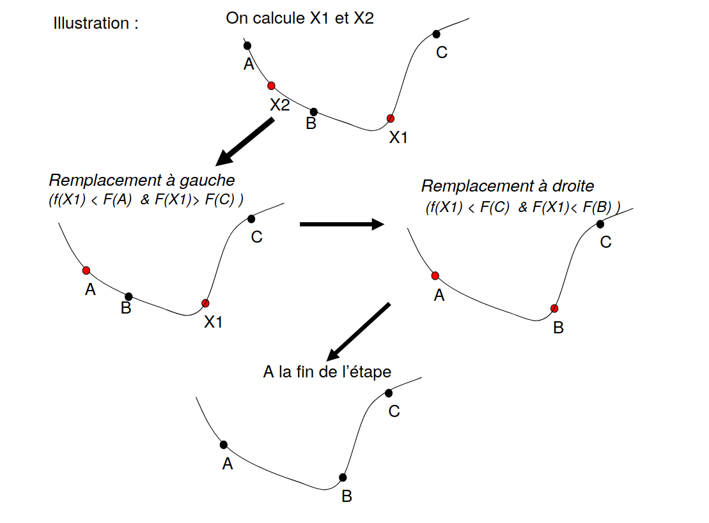
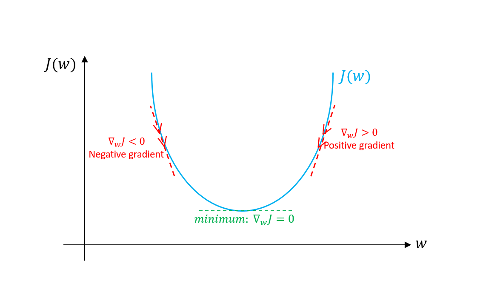
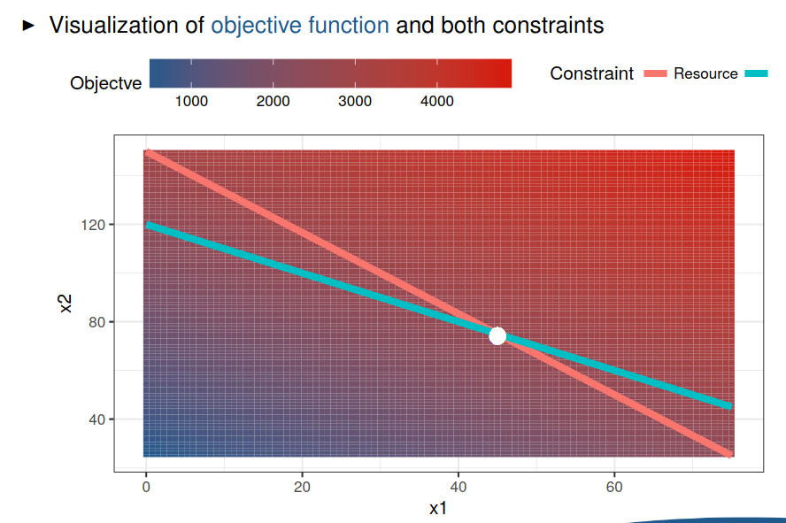

# Résolution de problèmes mathématiques ou statistiques

On s'intéresse ici à décrire certaines librairies de codes qui permettent de résoudre des problèmes mathématiques/


## Problème d'optimisation 

On cherche le minimum des fonctions suivantes : $f_1(x)= 80 + x ^ 2 + 3x$ et $f_2(x)=10\sin(0.3x)\sin(1.3x^2) + 0.00001x^4 + 0.2x+80$ que l'on peut dans un premier temps visualiser : 

```{r, eval = T, fig.height = 4, fig.width = 10}
f1 <- function (x) 80 + x ^ 2 + 3 * x  
f2 <- function (x) 10 * sin(0.3 * x) * sin(1.3 * x ^ 2) + 0.00001 * x ^ 4 + 0.2 * x + 80  
par(mfrow = c(1, 2))
plot(f1, -50, 50, n = 1000, type = "l", col = "red")
plot(f2, -50, 50, n = 1000, type = "l", col = "blue")
```

Pour trouver le minimum, on présente deux solutions :

* Solution 1: si on connaît la dérivée des fonctions, il suffit de trouver $x_c$ tel que $f'(x_c)=0$. Si de plus, $f''(x_{c}) =  > 0$, on est bien en présence d'un minimum. Ici :

$$f_1'(x)=0 	\Longleftrightarrow  x_{min} = -3/2$$ 

* Solution 2 : on calcule $f$ pour différentes valeurs de $x$ (on discrétise sur l'intervalle où ion suspecte de trouver le minimum, par exemple $-50,-49.99,-49.98,\ldots,49.99,50$) and on attribue le minimum à la plus petite valeur trouvée. 

**Remarque:** pour $f_1$, on devrait trouver le minimum, mais pour $f_2$, on n'aura pas suffisament de détails :

```{r, eval = T}
x_eval <- seq(-50, 50, by = 0.01)
f1_eval <- f1(x_eval)
f2_eval <- f2(x_eval)
x_eval[which.min(f1_eval)]
x_eval[which.min(f2_eval)]
```

Parmi les algorithme d'optimisation, on présente ici le `Golden section`: 

```{r, echo = F}
  
```

La fonction `optimize()` utilise cette algorithme et peut être utilisé dans un problème à 1 dimension, i.e. $x\in\mathcal{R^d}$ avec $d=1$

```{r, eval = T, fig.height = 4, fig.width = 10}
my_opti <- optimize(f2, interval = c(-50, 50))
plot(f2, -50, 50, n = 1000, type = "l", col = "blue")
points(my_opti$minimum, my_opti$objective, col = "red", pch = 16)
```

**Remarque:** cette algorithme ne garantit pas de trouver un minimum global, car il peut très bien s'arrêter sur un minimum local. 


Un autre type d'algorithme est basée sur la recherche du gradient: 

```{r, echo = F}
  
```


La fonction `optim()` permet de résoudre ce type de problème avec une dimension supérieure à 1 : ici, $x\in\mathcal{R^d},d\geq 1$. Il existe plusieurs méthodes de gradients : 

```{r, eval = F, echo = T}
my_opti_1 <- optim(0, f2, method = "Nelder-Mead")
my_opti_2 <- optim(0, f2, method = "BFGS")
my_opti_3 <- optim(0, f2, method = "CG")
my_opti_4 <- optim(0, f2, method = "L-BFGS-B")
my_opti_5 <- optim(0, f2, method = "SANN", control = list(maxit = 20000, temp = 20, parscale = 20))
plot(f2, -20, 20, n = 10000, type = "l", col = "blue")
points(c(my_opti_1$par, my_opti_2$par, my_opti_3$par, my_opti_4$par, my_opti_5$par),
       c(my_opti_1$value, my_opti_2$value, my_opti_3$value, my_opti_4$value, my_opti_5$value),
       col = c("red", "orange", "blue", "yellow", "green"), pch = 16, cex = 2)
```

```{r, eval = T, echo = F, fig.height = 3, fig.width = 10, warning = F}
my_opti_1 <- optim(0, f2, method = "Nelder-Mead")
my_opti_2 <- optim(0, f2, method = "BFGS")
my_opti_3 <- optim(0, f2, method = "CG")
my_opti_4 <- optim(0, f2, method = "L-BFGS-B")
my_opti_5 <- optim(0, f2, method = "SANN", control = list(maxit = 20000, temp = 20, parscale = 20))
par(oma = c(0, 0, 0, 0), mar = c(2, 2, 0, 0))
plot(f2, -20, 20, n = 10000, type = "l", col = "blue")
points(c(my_opti_1$par, my_opti_2$par, my_opti_3$par, my_opti_4$par, my_opti_5$par),
       c(my_opti_1$value, my_opti_2$value, my_opti_3$value, my_opti_4$value, my_opti_5$value),
       col = c("red", "orange", "blue", "yellow", "green"), pch = 16, cex = 2)
```

### Programmation linéaire 

En économie, la programmation linéaire est très utilisée. Le problème se pose de la façon suivante : 

* Fonction objective  
    + Le but est de maximiser le profit total 
    + Les produits A et B sont vendus respectivement 25€ et 20€
* Les contraintes de ressource 
    + Le produit A nécessite 20 unités de resources alors que le produit B en nécessite 12 
    + Seulement 1800 unités de resources sont disponibles par jour
* Contrainte de temps 
    + Chaque produit a une contrainte de production de 1/15 heure
    + Une journée de travail est de 8 heures

Ce problème se pose mathématiquement de la façon suivante: optimiser la $f(x_1,x_2)=25x_1+20x_2$ sous les contraintes  
$$\left\{
    \begin{array}{ll}
        20x_1 + 12x_2 & \leq 1800 \\
        \frac{1}{15}x_1+\frac{1}{15}x_2 & \leq 8
    \end{array}
\right.$$

Voir plus d'informations [ici](https://www.is.uni-freiburg.de/resources/computational-economics/5_OptimizationR.pdf).

Dans un premier temps, on va écrire le problème matriciellement:

* Maximiser $c^Tx$ avec 

$$c=\left(
    \begin{array}{l}
     25\\
     20
    \end{array}
\right),$$

$$x=\left(
    \begin{array}{l}
     x_1\\
     x_2
    \end{array}
\right).$$

* sous les contraintes  $Ax\leq b$ avec 

$$A=\left(
    \begin{array}{ll}
     20 & 12\\
     1/15 & 1/15
    \end{array}
\right),$$

$$b=\left(
    \begin{array}{l}
     1800\\
     8
    \end{array}
\right).$$


Pour visualiser le problème : 

```{r, echo = F}
  
```

Pour résoudre le problème linéaire numériquement, on peut utiliser la librairie **lpSolve** :

```{r}
library(lpSolve)
```

On formalise l'exemple précédent de la manière suivante : 

```{r}
objective.in <- c(25, 20)
const.mat <- matrix(c(20, 12, 1/15, 1/15), nrow = 2, byrow = TRUE)
const.dir <- c("<=", "<=")
const.rhs <- c(1800, 8)
optimum <- lp(direction = "max", objective.in, const.mat, const.dir, const.rhs)
```

La solution du problème est :
```{r}
optimum$solution
optimum$objval
```


Quelques références pour les problèmes d'optimisation :

* http://www.msc.univ-paris-diderot.fr/~daerr/teaching/phynumM1/notes2cours/methodes_numeriques_MINI.pdf

* http://www.di.fc.ul.pt/~jpn/r/optimization/optimization.html

* https://www.is.uni-freiburg.de/resources/computational-economics/5_OptimizationR.pdf

* https://www.kdnuggets.com/2018/05/optimization-using-r.html


**Exercise 1** 

* We consider the following model in the **wage1** data.

$$log(wage)=\beta_0+\beta_1 educ + \epsilon$$

Use an optimization program to find $\beta_0,\beta_1$ which minimize $\sum(y_i-\beta_0-\beta_1x)^2$ and compare the results with the function $lm()$

```{r, eval = F, echo = F}
library(wooldridge)
f <- function(x) {
beta_0 <- x[1]
beta_1 <- x[2]
 sum((wage1$lwage - beta_0 - beta_1 * wage1$educ) ^ 2)
}
optim(par = c(0, 0), fn = f)
```
